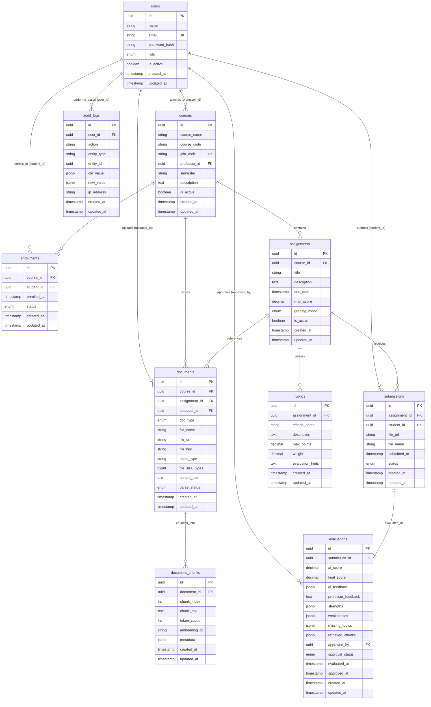
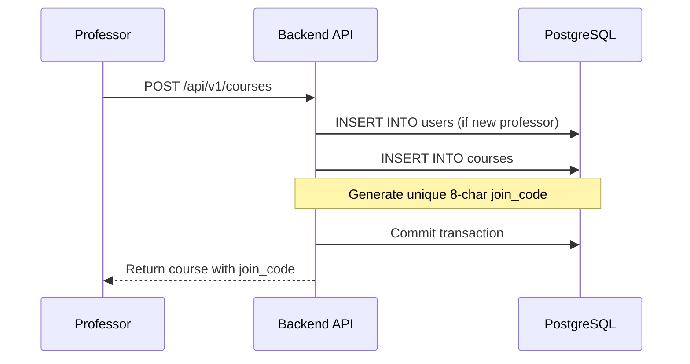
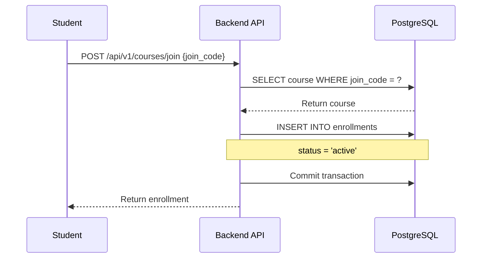
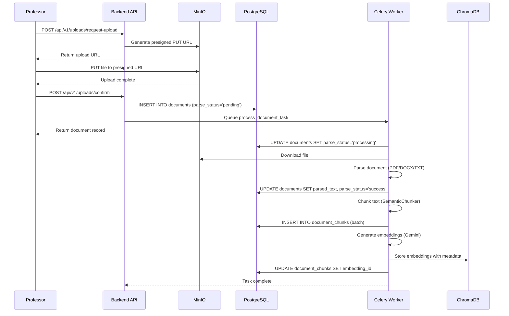
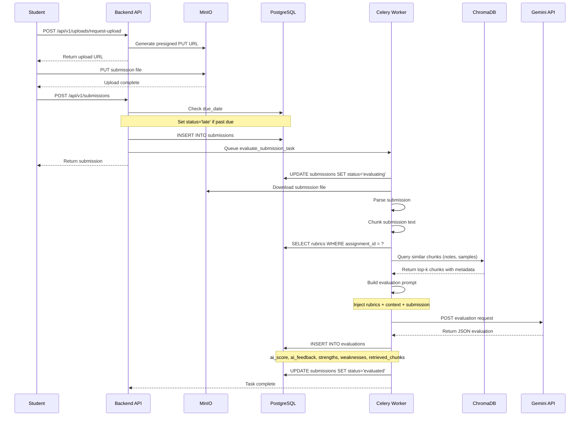
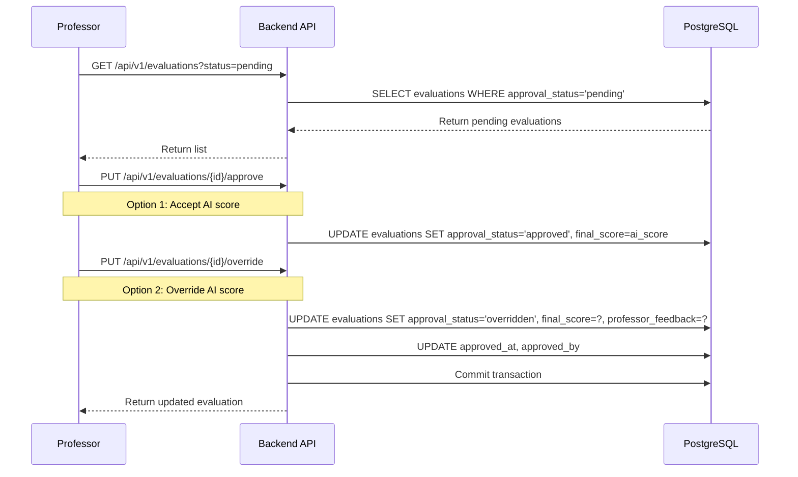

# Database Schema Documentation

## Overview

GradeAI uses **PostgreSQL** as its primary relational database. The schema consists of **10 core tables** that model the complete lifecycle of course management, assignment grading, and AI-powered evaluation.

The database design follows these principles:
- **UUID primary keys** for all tables (using `gen_random_uuid()`)
- **Soft deletes** where appropriate (via `is_active` flags)
- **Audit trail** via timestamps on all tables (`created_at`, `updated_at`)
- **Referential integrity** enforced through foreign keys with explicit cascade behaviors
- **Enumerated types** for status fields to ensure data consistency
- **JSONB columns** for flexible metadata and evaluation results
- **Automatic timestamp updates** via PostgreSQL triggers

## Table of Contents

1. [Entity Relationship Diagram](#entity-relationship-diagram)
2. [Table Details](#table-details)
   - [users](#1-users)
   - [courses](#2-courses)
   - [enrollments](#3-enrollments)
   - [assignments](#4-assignments)
   - [rubrics](#5-rubrics)
   - [documents](#6-documents)
   - [document_chunks](#7-document_chunks)
   - [submissions](#8-submissions)
   - [evaluations](#9-evaluations)
   - [audit_logs](#10-audit_logs)
3. [Enumerated Types](#enumerated-types)
4. [Indexes and Constraints](#indexes-and-constraints)
5. [Database Functions and Triggers](#database-functions-and-triggers)
6. [Data Lifecycle](#data-lifecycle)
7. [Business Rules](#business-rules)

---

## Entity Relationship Diagram



---

## Table Details

### 1. users

**Purpose**: Stores all system users (professors, students, TAs, admins).

**Location**: `backend/app/models/user.py`

**Schema**:

| Column | Type | Constraints | Description |
|--------|------|-------------|-------------|
| `id` | UUID | PRIMARY KEY, DEFAULT gen_random_uuid() | Unique user identifier |
| `name` | VARCHAR(255) | NOT NULL | User's full name |
| `email` | VARCHAR(255) | NOT NULL, UNIQUE | User's email address (login credential) |
| `password_hash` | VARCHAR(255) | NOT NULL | Bcrypt-hashed password |
| `role` | ENUM(user_role) | NOT NULL | User role: `professor`, `student`, `ta`, `admin` |
| `is_active` | BOOLEAN | NOT NULL, DEFAULT true | Soft delete flag |
| `created_at` | TIMESTAMP WITH TIME ZONE | NOT NULL, DEFAULT NOW() | Account creation timestamp |
| `updated_at` | TIMESTAMP WITH TIME ZONE | NOT NULL, DEFAULT NOW() | Last update timestamp (auto-updated) |

**Indexes**:
- `ix_users_email` (UNIQUE): Fast email lookup for authentication
- `ix_users_role`: Filter users by role

**Relationships**:
- **courses_taught** → Many `Course` records (as professor)
- **enrollments** → Many `Enrollment` records (as student)
- **documents_uploaded** → Many `Document` records (as uploader)
- **submissions** → Many `Submission` records (as student)
- **evaluations_approved** → Many `Evaluation` records (as approver)
- **audit_logs** → Many `AuditLog` records

**Business Rules**:
- Email must be unique across all users
- Password is never stored in plaintext (see `backend/app/core/security.py:hash_password()`)
- `is_active=false` prevents login but preserves data integrity
- Professors cannot be deleted if they have courses (RESTRICT cascade)


---

### 2. courses

**Purpose**: Represents academic courses taught by professors.

**Location**: `backend/app/models/course.py`

**Schema**:

| Column | Type | Constraints | Description |
|--------|------|-------------|-------------|
| `id` | UUID | PRIMARY KEY, DEFAULT gen_random_uuid() | Unique course identifier |
| `course_name` | VARCHAR(255) | NOT NULL | Course title (e.g., "Data Structures") |
| `course_code` | VARCHAR(64) | NOT NULL | Course code (e.g., "CS-201") |
| `join_code` | VARCHAR(8) | NOT NULL, UNIQUE | 8-character code for student enrollment |
| `professor_id` | UUID | NOT NULL, FK → users.id (RESTRICT) | Professor who teaches the course |
| `semester` | VARCHAR(64) | NOT NULL | Semester identifier (e.g., "Fall 2026") |
| `description` | TEXT | NULLABLE | Course description |
| `is_active` | BOOLEAN | NOT NULL, DEFAULT true | Whether course is currently active |
| `created_at` | TIMESTAMP WITH TIME ZONE | NOT NULL, DEFAULT NOW() | Course creation timestamp |
| `updated_at` | TIMESTAMP WITH TIME ZONE | NOT NULL, DEFAULT NOW() | Last update timestamp |

**Indexes**:
- `ix_courses_professor_id`: Fast lookup of courses by professor
- `ix_courses_course_code`: Search courses by code
- `ix_courses_semester`: Filter courses by semester
- `ix_courses_join_code` (UNIQUE): Fast join code validation

**Constraints**:
- `uq_courses_professor_course_code`: A professor cannot create duplicate course codes

**Relationships**:
- **professor** → One `User` (role=professor)
- **enrollments** → Many `Enrollment` records (CASCADE delete)
- **assignments** → Many `Assignment` records (CASCADE delete)
- **documents** → Many `Document` records

**Business Rules**:
- `join_code` is generated as a unique 8-character alphanumeric string (see `backend/app/api/v1/endpoints/courses.py`)
- Professor cannot be deleted while teaching active courses (RESTRICT)
- Deleting a course cascades to enrollments and assignments
- Same professor can teach the same course in different semesters


---

### 3. enrollments

**Purpose**: Links students to courses they have joined.

**Location**: `backend/app/models/enrollment.py`

**Schema**:

| Column | Type | Constraints | Description |
|--------|------|-------------|-------------|
| `id` | UUID | PRIMARY KEY, DEFAULT gen_random_uuid() | Unique enrollment identifier |
| `course_id` | UUID | NOT NULL, FK → courses.id (CASCADE) | Course being enrolled in |
| `student_id` | UUID | NOT NULL, FK → users.id (CASCADE) | Student enrolling |
| `enrolled_at` | TIMESTAMP WITH TIME ZONE | NOT NULL, DEFAULT NOW() | Enrollment timestamp |
| `status` | ENUM(enrollment_status) | NOT NULL, DEFAULT 'active' | Enrollment status: `active`, `dropped` |
| `created_at` | TIMESTAMP WITH TIME ZONE | NOT NULL, DEFAULT NOW() | Record creation timestamp |
| `updated_at` | TIMESTAMP WITH TIME ZONE | NOT NULL, DEFAULT NOW() | Last update timestamp |

**Indexes**:
- `ix_enrollments_course_id`: Fast lookup of students in a course
- `ix_enrollments_student_id`: Fast lookup of courses for a student
- `ix_enrollments_status`: Filter enrollments by status

**Constraints**:
- `uq_enrollments_course_student`: A student can only enroll in a course once

**Relationships**:
- **course** → One `Course` (CASCADE delete)
- **student** → One `User` (CASCADE delete)

**Business Rules**:
- Students join via `join_code` (see `backend/app/api/v1/endpoints/courses.py:join_course()`)
- Enrollment is created with `status='active'` by default
- `status='dropped'` is a soft delete (student unenrolls but history is preserved)
- Deleting a course or user cascades to enrollments
- Re-enrollment is prevented by unique constraint


---

### 4. assignments

**Purpose**: Represents graded assignments within courses.

**Location**: `backend/app/models/assignment.py`

**Schema**:

| Column | Type | Constraints | Description |
|--------|------|-------------|-------------|
| `id` | UUID | PRIMARY KEY, DEFAULT gen_random_uuid() | Unique assignment identifier |
| `course_id` | UUID | NOT NULL, FK → courses.id (CASCADE) | Parent course |
| `title` | VARCHAR(512) | NOT NULL | Assignment title |
| `description` | TEXT | NULLABLE | Assignment instructions |
| `due_date` | TIMESTAMP WITH TIME ZONE | NOT NULL | Submission deadline |
| `max_score` | NUMERIC(10, 2) | NOT NULL | Maximum possible score |
| `grading_mode` | ENUM(grading_mode) | NOT NULL | Grading mode: `auto`, `manual`, `hybrid` |
| `is_active` | BOOLEAN | NOT NULL, DEFAULT true | Whether assignment accepts submissions |
| `created_at` | TIMESTAMP WITH TIME ZONE | NOT NULL, DEFAULT NOW() | Assignment creation timestamp |
| `updated_at` | TIMESTAMP WITH TIME ZONE | NOT NULL, DEFAULT NOW() | Last update timestamp |

**Indexes**:
- `ix_assignments_course_id`: Fast lookup of assignments by course
- `ix_assignments_due_date`: Query assignments by deadline
- `ix_assignments_grading_mode`: Filter by grading mode

**Relationships**:
- **course** → One `Course` (CASCADE delete)
- **rubrics** → Many `Rubric` records (CASCADE delete)
- **documents** → Many `Document` records (notes, samples, rubric docs)
- **submissions** → Many `Submission` records (CASCADE delete)

**Business Rules**:
- Created by professors via `backend/app/api/v1/endpoints/assignments.py:create_assignment()`
- `max_score` must match the sum of rubric `max_points` (enforced in application logic)
- `grading_mode` determines evaluation workflow:
  - `auto`: AI evaluates automatically
  - `manual`: Professor grades manually
  - `hybrid`: AI evaluates, professor reviews/overrides
- `is_active=false` prevents new submissions
- Deleting a course cascades to assignments


---

### 5. rubrics

**Purpose**: Defines grading criteria for assignments.

**Location**: `backend/app/models/rubric.py`

**Schema**:

| Column | Type | Constraints | Description |
|--------|------|-------------|-------------|
| `id` | UUID | PRIMARY KEY, DEFAULT gen_random_uuid() | Unique rubric criterion identifier |
| `assignment_id` | UUID | NOT NULL, FK → assignments.id (CASCADE) | Parent assignment |
| `criteria_name` | VARCHAR(255) | NOT NULL | Criterion name (e.g., "Code Quality") |
| `description` | TEXT | NULLABLE | Detailed criterion description |
| `max_points` | NUMERIC(10, 2) | NOT NULL | Maximum points for this criterion |
| `weight` | NUMERIC(5, 2) | NOT NULL | Weight in overall score (0.0 - 1.0) |
| `evaluation_hints` | TEXT | NULLABLE | Hints for AI evaluator (prompt guidance) |
| `created_at` | TIMESTAMP WITH TIME ZONE | NOT NULL, DEFAULT NOW() | Rubric creation timestamp |
| `updated_at` | TIMESTAMP WITH TIME ZONE | NOT NULL, DEFAULT NOW() | Last update timestamp |

**Indexes**:
- `ix_rubrics_assignment_id`: Fast lookup of rubrics by assignment

**Relationships**:
- **assignment** → One `Assignment` (CASCADE delete)

**Business Rules**:
- Created via `backend/app/api/v1/endpoints/assignments.py:create_rubric()`
- `weight` is typically proportional to `max_points` but can vary
- Sum of all rubric `max_points` should equal assignment `max_score` (validated in application)
- `evaluation_hints` are injected into AI prompts (see `backend/app/rag/evaluator.py:_build_evaluation_prompt()`)
- Deleting an assignment cascades to rubrics
- Weight stored as NUMERIC(5, 2) allows values like 0.25 (25% weight)

**Example**:
```sql
-- Assignment max_score = 100
INSERT INTO rubrics VALUES
  ('...', assignment_id, 'Code Correctness', '...', 40.00, 0.40, 'Check if code runs without errors'),
  ('...', assignment_id, 'Code Quality', '...', 30.00, 0.30, 'Evaluate readability and style'),
  ('...', assignment_id, 'Documentation', '...', 30.00, 0.30, 'Check comments and docstrings');
```


---

### 6. documents

**Purpose**: Stores uploaded files (lecture notes, rubric documents, sample solutions).

**Location**: `backend/app/models/document.py`

**Schema**:

| Column | Type | Constraints | Description |
|--------|------|-------------|-------------|
| `id` | UUID | PRIMARY KEY, DEFAULT gen_random_uuid() | Unique document identifier |
| `course_id` | UUID | NOT NULL, FK → courses.id (CASCADE) | Course this document belongs to |
| `assignment_id` | UUID | NULLABLE, FK → assignments.id (SET NULL) | Assignment (if specific to one) |
| `uploader_id` | UUID | NOT NULL, FK → users.id (RESTRICT) | User who uploaded the document |
| `doc_type` | ENUM(document_type) | NOT NULL | Document type: `rubric`, `notes`, `sample_solution`, `submission` |
| `file_name` | VARCHAR(512) | NOT NULL | Original filename |
| `file_url` | VARCHAR(2048) | NOT NULL | Presigned URL or MinIO path |
| `file_key` | VARCHAR(1024) | NOT NULL, DEFAULT '' | MinIO object key |
| `mime_type` | VARCHAR(127) | NOT NULL | MIME type (e.g., "application/pdf") |
| `file_size_bytes` | BIGINT | NOT NULL | File size in bytes |
| `parsed_text` | TEXT | NULLABLE | Extracted text content (after parsing) |
| `parse_status` | ENUM(parse_status) | NOT NULL, DEFAULT 'pending' | Parsing status: `pending`, `processing`, `success`, `failed` |
| `created_at` | TIMESTAMP WITH TIME ZONE | NOT NULL, DEFAULT NOW() | Upload timestamp |
| `updated_at` | TIMESTAMP WITH TIME ZONE | NOT NULL, DEFAULT NOW() | Last update timestamp |

**Indexes**:
- `ix_documents_course_id`: Fast lookup of documents by course
- `ix_documents_assignment_id`: Fast lookup of documents by assignment
- `ix_documents_uploader_id`: Fast lookup of uploads by user
- `ix_documents_doc_type`: Filter documents by type
- `ix_documents_parse_status`: Query documents by parsing status

**Relationships**:
- **course** → One `Course` (CASCADE delete)
- **assignment** → One `Assignment` (SET NULL on delete)
- **uploader** → One `User` (RESTRICT delete)
- **chunks** → Many `DocumentChunk` records (CASCADE delete)


**Business Rules**:
- Upload flow: `backend/app/api/v1/endpoints/uploads.py:request_upload_url()` → MinIO → `backend/app/tasks/grading.py:process_document_task()`
- `file_url` is a presigned URL valid for 7 days (see `backend/app/core/config.py:MINIO_PRESIGNED_URL_EXPIRY`)
- `file_key` is the MinIO object key (format: `{course_id}/{assignment_id}/{filename}`)
- `doc_type` determines RAG context usage:
  - `notes`: Lecture material for reference
  - `sample_solution`: Ideal submission for comparison
  - `rubric`: Detailed grading criteria (not yet fully implemented)
  - `submission`: Student-submitted work (stored separately as submission files, not in documents table)
- `parse_status` lifecycle:
  - `pending`: Uploaded but not yet processed
  - `processing`: Currently being parsed by Celery task
  - `success`: Text extracted and stored in `parsed_text`
  - `failed`: Parsing failed (invalid file, unsupported format, etc.)
- Parsing handled by `backend/app/rag/parsers.py:UnifiedDocumentParser`
- Deleting assignment sets `assignment_id` to NULL (document preserved)
- Deleting course cascades to documents
- Uploader cannot be deleted if they have uploaded documents

---

### 7. document_chunks

**Purpose**: Stores text chunks from parsed documents for RAG retrieval.

**Location**: `backend/app/models/document_chunk.py`

**Schema**:

| Column | Type | Constraints | Description |
|--------|------|-------------|-------------|
| `id` | UUID | PRIMARY KEY, DEFAULT gen_random_uuid() | Unique chunk identifier |
| `document_id` | UUID | NOT NULL, FK → documents.id (CASCADE) | Parent document |
| `chunk_index` | INTEGER | NOT NULL | Sequential chunk number (0-indexed) |
| `chunk_text` | TEXT | NOT NULL | Actual text content of the chunk |
| `token_count` | INTEGER | NOT NULL | Number of tokens in chunk (for LLM context limits) |
| `embedding_id` | VARCHAR(255) | NULLABLE | ChromaDB embedding ID |
| `metadata` | JSONB | NULLABLE | Additional metadata (doc_type, course_id, etc.) |
| `created_at` | TIMESTAMP WITH TIME ZONE | NOT NULL, DEFAULT NOW() | Chunk creation timestamp |
| `updated_at` | TIMESTAMP WITH TIME ZONE | NOT NULL, DEFAULT NOW() | Last update timestamp |


**Indexes**:
- `ix_document_chunks_document_id`: Fast lookup of chunks by document
- `ix_document_chunks_embedding_id`: Fast lookup by ChromaDB ID
- `ix_document_chunks_document_chunk_index` (UNIQUE): Enforce unique chunk index per document

**Constraints**:
- `uq_document_chunks_document_index`: Each document has unique chunk indices

**Relationships**:
- **document** → One `Document` (CASCADE delete)

**Business Rules**:
- Created by `backend/app/tasks/grading.py:chunk_and_embed_task()` after document parsing
- Chunking strategy implemented in `backend/app/rag/chunker.py:SemanticChunker`
- `chunk_text` is typically 400-600 tokens (configurable via `CHUNK_SIZE`)
- `token_count` calculated using tiktoken (model: text-embedding-004)
- `embedding_id` format: `{document_id}_{chunk_index}` (e.g., "123e4567-..._0")
- `metadata` structure (see `backend/app/rag/chunker.py:create_chunks()`):
  ```json
  {
    "document_id": "uuid",
    "doc_type": "notes|sample_solution|rubric",
    "course_id": "uuid",
    "assignment_id": "uuid",
    "chunk_index": 0,
    "file_name": "lecture1.pdf"
  }
  ```
- Deleting a document cascades to chunks
- Embeddings stored in ChromaDB with same `embedding_id` for cross-referencing


---

### 8. submissions

**Purpose**: Stores student assignment submissions.

**Location**: `backend/app/models/submission.py`

**Schema**:

| Column | Type | Constraints | Description |
|--------|------|-------------|-------------|
| `id` | UUID | PRIMARY KEY, DEFAULT gen_random_uuid() | Unique submission identifier |
| `assignment_id` | UUID | NOT NULL, FK → assignments.id (CASCADE) | Assignment being submitted |
| `student_id` | UUID | NOT NULL, FK → users.id (CASCADE) | Student who submitted |
| `file_url` | VARCHAR(2048) | NOT NULL | Presigned URL to submission file |
| `file_name` | VARCHAR(512) | NOT NULL | Original filename |
| `submitted_at` | TIMESTAMP WITH TIME ZONE | NOT NULL, DEFAULT NOW() | Submission timestamp |
| `status` | ENUM(submission_status) | NOT NULL, DEFAULT 'submitted' | Status: `submitted`, `evaluating`, `evaluated`, `late` |
| `created_at` | TIMESTAMP WITH TIME ZONE | NOT NULL, DEFAULT NOW() | Record creation timestamp |
| `updated_at` | TIMESTAMP WITH TIME ZONE | NOT NULL, DEFAULT NOW() | Last update timestamp |

**Indexes**:
- `ix_submissions_assignment_id`: Fast lookup of submissions by assignment
- `ix_submissions_student_id`: Fast lookup of submissions by student
- `ix_submissions_submitted_at`: Query submissions by time
- `ix_submissions_status`: Filter submissions by status

**Constraints**:
- `uq_submissions_assignment_student`: Each student can submit to an assignment only once

**Relationships**:
- **assignment** → One `Assignment` (CASCADE delete)
- **student** → One `User` (CASCADE delete)
- **evaluation** → One `Evaluation` (CASCADE delete, one-to-one)

**Business Rules**:
- Created via `backend/app/api/v1/endpoints/submissions.py:create_submission()`
- Students upload files to MinIO, then create submission record
- `status` lifecycle:
  - `submitted`: Initial state after upload
  - `evaluating`: Grading task is running
  - `evaluated`: Evaluation complete
  - `late`: Submitted after `assignment.due_date`
- Late submissions automatically flagged (checked in `create_submission()`)
- One submission row per student per assignment (unique constraint). Resubmitting
  overwrites that row and re-processes the new file (see Submission Rules below).
- Deleting assignment or student cascades to submissions


---

### 9. evaluations

**Purpose**: Stores AI-generated evaluations and professor feedback.

**Location**: `backend/app/models/evaluation.py`

**Schema**:

| Column | Type | Constraints | Description |
|--------|------|-------------|-------------|
| `id` | UUID | PRIMARY KEY, DEFAULT gen_random_uuid() | Unique evaluation identifier |
| `submission_id` | UUID | NOT NULL, UNIQUE, FK → submissions.id (CASCADE) | Submission being evaluated |
| `ai_score` | NUMERIC(10, 2) | NOT NULL | AI-generated score |
| `final_score` | NUMERIC(10, 2) | NULLABLE | Professor-approved final score |
| `ai_feedback` | JSONB | NULLABLE | Structured AI feedback per rubric criterion |
| `professor_feedback` | TEXT | NULLABLE | Professor's written feedback |
| `strengths` | JSONB | NULLABLE | Array of identified strengths |
| `weaknesses` | JSONB | NULLABLE | Array of identified weaknesses |
| `missing_topics` | JSONB | NULLABLE | Array of missing topics |
| `retrieved_chunks` | JSONB | NULLABLE | Array of document chunks used for context |
| `approved_by` | UUID | NULLABLE, FK → users.id (SET NULL) | Professor who approved/overrode |
| `approval_status` | ENUM(approval_status) | NOT NULL, DEFAULT 'pending' | Status: `pending`, `approved`, `overridden` |
| `evaluated_at` | TIMESTAMP WITH TIME ZONE | NOT NULL | When AI evaluation completed |
| `approved_at` | TIMESTAMP WITH TIME ZONE | NULLABLE | When professor approved |
| `created_at` | TIMESTAMP WITH TIME ZONE | NOT NULL, DEFAULT NOW() | Record creation timestamp |
| `updated_at` | TIMESTAMP WITH TIME ZONE | NOT NULL, DEFAULT NOW() | Last update timestamp |

**Indexes**:
- `ix_evaluations_submission_id` (UNIQUE): One evaluation per submission
- `ix_evaluations_approved_by`: Query evaluations by approver
- `ix_evaluations_approval_status`: Filter by approval status
- `ix_evaluations_evaluated_at`: Query evaluations by time

**Relationships**:
- **submission** → One `Submission` (CASCADE delete, one-to-one)
- **approved_by_user** → One `User` (SET NULL on delete)


**Business Rules**:
- Created by `backend/app/tasks/grading.py:evaluate_submission_task()` after submission
- `ai_score` is calculated by Gemini 1.5 Pro (see `backend/app/rag/evaluator.py:RubricEvaluator.evaluate()`)
- `ai_feedback` structure (per rubric criterion):
  ```json
  {
    "criterion_name": {
      "score": 8.5,
      "max_points": 10.0,
      "feedback": "Good implementation but missing edge cases"
    }
  }
  ```
- `strengths`, `weaknesses`, `missing_topics` are arrays extracted from Gemini response
- `retrieved_chunks` stores the document chunks used for RAG context:
  ```json
  [
    {
      "chunk_id": "uuid",
      "document_id": "uuid",
      "doc_type": "notes",
      "similarity": 0.85,
      "text": "..."
    }
  ]
  ```
- `approval_status` workflow:
  - `pending`: AI evaluation complete, awaiting professor review
  - `approved`: Professor accepts AI score (`final_score` = `ai_score`)
  - `overridden`: Professor changes score (`final_score` ≠ `ai_score`)
- Professor approval via `backend/app/api/v1/endpoints/evaluations.py:approve_evaluation()`
- `final_score` is `NULL` until professor approves
- One-to-one relationship with submissions enforced by unique constraint
- Deleting submission cascades to evaluation


---

### 10. audit_logs

**Purpose**: Tracks all critical actions for compliance and debugging.

**Location**: `backend/app/models/audit_log.py`

**Schema**:

| Column | Type | Constraints | Description |
|--------|------|-------------|-------------|
| `id` | UUID | PRIMARY KEY, DEFAULT gen_random_uuid() | Unique log entry identifier |
| `user_id` | UUID | NULLABLE, FK → users.id (SET NULL) | User who performed the action |
| `action` | VARCHAR(128) | NOT NULL | Action type (e.g., "CREATE", "UPDATE", "DELETE") |
| `entity_type` | VARCHAR(128) | NOT NULL | Entity type (e.g., "Assignment", "Evaluation") |
| `entity_id` | UUID | NOT NULL | ID of the affected entity |
| `old_value` | JSONB | NULLABLE | Previous state (for updates) |
| `new_value` | JSONB | NULLABLE | New state (for creates/updates) |
| `ip_address` | VARCHAR(45) | NULLABLE | User's IP address (IPv4 or IPv6) |
| `created_at` | TIMESTAMP WITH TIME ZONE | NOT NULL, DEFAULT NOW() | When action occurred |
| `updated_at` | TIMESTAMP WITH TIME ZONE | NOT NULL, DEFAULT NOW() | Last update timestamp |

**Indexes**:
- `ix_audit_logs_user_id`: Query logs by user
- `ix_audit_logs_action`: Filter logs by action type
- `ix_audit_logs_entity_type`: Filter logs by entity type
- `ix_audit_logs_entity_id`: Query logs for specific entity
- `ix_audit_logs_created_at`: Time-based queries

**Relationships**:
- **user** → One `User` (SET NULL on delete)

**Business Rules**:
- Audit logging implemented in `backend/app/core/handlers.py` (not fully implemented in all endpoints)
- `user_id` can be NULL for system-generated actions
- `action` examples: "CREATE_COURSE", "APPROVE_EVALUATION", "OVERRIDE_SCORE"
- `entity_type` examples: "Course", "Assignment", "Evaluation", "Submission"
- `old_value` and `new_value` store JSON snapshots of entity state
- `ip_address` extracted from request headers (supports IPv6 format)
- Logs are append-only (no updates or deletes)
- Deleting a user preserves their audit logs (SET NULL)


---

## Enumerated Types

All enum types are defined in `backend/app/core/enums.py` and created as PostgreSQL ENUM types in `backend/alembic/versions/001_initial_schema.py`.

### user_role

**Values**: `professor`, `student`, `ta`, `admin`

**Purpose**: Defines user access levels and permissions.

**Usage**:
- `professor`: Can create courses, assignments, rubrics, approve evaluations
- `student`: Can enroll in courses, submit assignments
- `ta`: Teaching assistant (not fully implemented)
- `admin`: Full system access (not fully implemented)

**Implementation**: `app.core.enums.UserRole`

---

### enrollment_status

**Values**: `active`, `dropped`

**Purpose**: Tracks student enrollment state.

**Usage**:
- `active`: Student is currently enrolled
- `dropped`: Student has unenrolled (soft delete)

**Implementation**: `app.core.enums.EnrollmentStatus`

---

### grading_mode

**Values**: `auto`, `manual`, `hybrid`

**Purpose**: Determines assignment evaluation workflow.

**Usage**:
- `auto`: AI evaluates automatically, no professor review required
- `manual`: Professor grades manually, no AI involvement
- `hybrid`: AI evaluates, professor reviews and approves/overrides

**Implementation**: `app.core.enums.GradingMode`

**Note**: Currently, all assignments use `hybrid` mode in practice.


---

### document_type

**Values**: `rubric`, `notes`, `sample_solution`, `submission`

**Purpose**: Categorizes uploaded documents for RAG retrieval.

**Usage**:
- `notes`: Lecture notes, course material (used as reference context)
- `sample_solution`: Ideal submission examples (used for comparison)
- `rubric`: Detailed grading criteria documents (not yet fully used in RAG)
- `submission`: Student-submitted files (stored as submissions, not documents)

**Implementation**: `app.core.enums.DocumentType`

**RAG Context Priority**: `sample_solution` (highest) → `notes` (medium) → `rubric` (lowest)

---

### parse_status

**Values**: `pending`, `processing`, `success`, `failed`

**Purpose**: Tracks document parsing progress.

**Usage**:
- `pending`: Uploaded but not yet processed
- `processing`: Currently being parsed by Celery worker
- `success`: Text extracted successfully
- `failed`: Parsing failed (unsupported format, corrupted file, etc.)

**Implementation**: `app.core.enums.ParseStatus`

**Lifecycle**: `pending` → `processing` → `success`/`failed`

---

### submission_status

**Values**: `submitted`, `evaluating`, `evaluated`, `late`

**Purpose**: Tracks submission evaluation progress.

**Usage**:
- `submitted`: Uploaded, awaiting evaluation
- `evaluating`: AI evaluation in progress
- `evaluated`: Evaluation complete
- `late`: Submitted after due date

**Implementation**: `app.core.enums.SubmissionStatus`

**Lifecycle**: `submitted`/`late` → `evaluating` → `evaluated`


---

### approval_status

**Values**: `pending`, `approved`, `overridden`

**Purpose**: Tracks professor review status of AI evaluations.

**Usage**:
- `pending`: AI evaluation complete, awaiting professor review
- `approved`: Professor accepts AI score without changes
- `overridden`: Professor modifies AI score or feedback

**Implementation**: `app.core.enums.ApprovalStatus`

**Workflow**: `pending` → `approved`/`overridden`

---

## Indexes and Constraints

### Primary Keys

All tables use **UUID primary keys** generated via PostgreSQL's `gen_random_uuid()` function (requires `pgcrypto` extension).

**Advantages**:
- Globally unique across distributed systems
- No sequential exposure (security)
- Allows client-side generation if needed

**Implementation**: `backend/app/models/mixins.py:UUIDPrimaryKeyMixin`

---

### Unique Constraints

| Table | Constraint | Columns | Purpose |
|-------|-----------|---------|---------|
| `users` | `uq_users_email` | `email` | Prevent duplicate accounts |
| `courses` | `uq_courses_professor_course_code` | `professor_id`, `course_code` | Prevent duplicate course codes per professor |
| `courses` | (unique index) | `join_code` | Ensure unique join codes |
| `enrollments` | `uq_enrollments_course_student` | `course_id`, `student_id` | Prevent duplicate enrollments |
| `document_chunks` | `uq_document_chunks_document_index` | `document_id`, `chunk_index` | Ensure unique chunk indices |
| `submissions` | `uq_submissions_assignment_student` | `assignment_id`, `student_id` | One submission per student per assignment |
| `evaluations` | `uq_evaluations_submission_id` | `submission_id` | One-to-one with submissions |


---

### Foreign Key Constraints

| Child Table | Column | Parent Table | Column | On Delete |
|-------------|--------|--------------|--------|-----------|
| `courses` | `professor_id` | `users` | `id` | RESTRICT |
| `enrollments` | `course_id` | `courses` | `id` | CASCADE |
| `enrollments` | `student_id` | `users` | `id` | CASCADE |
| `assignments` | `course_id` | `courses` | `id` | CASCADE |
| `rubrics` | `assignment_id` | `assignments` | `id` | CASCADE |
| `documents` | `course_id` | `courses` | `id` | CASCADE |
| `documents` | `assignment_id` | `assignments` | `id` | SET NULL |
| `documents` | `uploader_id` | `users` | `id` | RESTRICT |
| `document_chunks` | `document_id` | `documents` | `id` | CASCADE |
| `submissions` | `assignment_id` | `assignments` | `id` | CASCADE |
| `submissions` | `student_id` | `users` | `id` | CASCADE |
| `evaluations` | `submission_id` | `submissions` | `id` | CASCADE |
| `evaluations` | `approved_by` | `users` | `id` | SET NULL |
| `audit_logs` | `user_id` | `users` | `id` | SET NULL |

**Cascade Behaviors**:
- **RESTRICT**: Prevents deletion if child records exist (data integrity protection)
- **CASCADE**: Automatically deletes child records (e.g., deleting course removes enrollments)
- **SET NULL**: Sets foreign key to NULL (preserves child records)

**Design Rationale**:
- Professors and uploaders cannot be deleted if they have dependent records (RESTRICT)
- Course deletion cascades to all related data (enrollments, assignments, documents)
- Assignment deletion preserves documents by setting `assignment_id` to NULL
- User deletion in evaluations preserves evaluation history (SET NULL on `approved_by`)


---

### Performance Indexes

All indexes are created in `backend/alembic/versions/001_initial_schema.py`.

#### Single-Column Indexes

| Table | Column | Purpose |
|-------|--------|---------|
| `users` | `email` | Fast authentication lookups |
| `users` | `role` | Filter users by role |
| `courses` | `professor_id` | Query courses by professor |
| `courses` | `course_code` | Search courses by code |
| `courses` | `semester` | Filter courses by semester |
| `courses` | `join_code` | Fast join code validation |
| `enrollments` | `course_id` | List students in course |
| `enrollments` | `student_id` | List courses for student |
| `enrollments` | `status` | Filter active enrollments |
| `assignments` | `course_id` | List assignments in course |
| `assignments` | `due_date` | Query assignments by deadline |
| `assignments` | `grading_mode` | Filter by grading mode |
| `rubrics` | `assignment_id` | Load rubrics for assignment |
| `documents` | `course_id` | List documents in course |
| `documents` | `assignment_id` | List documents for assignment |
| `documents` | `uploader_id` | List uploads by user |
| `documents` | `doc_type` | Filter documents by type |
| `documents` | `parse_status` | Query parsing status |
| `document_chunks` | `document_id` | Load chunks for document |
| `document_chunks` | `embedding_id` | ChromaDB cross-reference |
| `submissions` | `assignment_id` | List submissions for assignment |
| `submissions` | `student_id` | List submissions by student |
| `submissions` | `submitted_at` | Sort submissions by time |
| `submissions` | `status` | Filter by evaluation status |
| `evaluations` | `submission_id` | One-to-one lookup |
| `evaluations` | `approved_by` | Query evaluations by approver |
| `evaluations` | `approval_status` | Filter by approval status |
| `evaluations` | `evaluated_at` | Sort evaluations by time |
| `audit_logs` | `user_id` | Query logs by user |
| `audit_logs` | `action` | Filter logs by action type |
| `audit_logs` | `entity_type` | Filter logs by entity |
| `audit_logs` | `entity_id` | Query logs for specific entity |
| `audit_logs` | `created_at` | Time-based log queries |


#### Composite Indexes

| Table | Columns | Type | Purpose |
|-------|---------|------|---------|
| `document_chunks` | `document_id`, `chunk_index` | UNIQUE | Enforce unique chunk indices and fast lookup |

**Index Strategy**:
- Foreign keys are automatically indexed for JOIN performance
- Enum columns are indexed for filtering (status fields)
- Timestamp columns are indexed for time-range queries
- Unique constraints automatically create indexes

---

## Database Functions and Triggers

### Timestamp Update Function

**Purpose**: Automatically update `updated_at` column on row updates.

**Implementation**: `backend/alembic/versions/001_initial_schema.py:_create_updated_at_function()`

```sql
CREATE OR REPLACE FUNCTION update_updated_at_column()
RETURNS TRIGGER AS $$
BEGIN
    NEW.updated_at = NOW();
    RETURN NEW;
END;
$$ LANGUAGE plpgsql;
```

**Applied to Tables**:
- `users`, `courses`, `enrollments`, `assignments`, `rubrics`
- `documents`, `document_chunks`, `submissions`, `evaluations`, `audit_logs`

**Trigger Creation** (example for users):
```sql
CREATE TRIGGER trg_users_updated_at
BEFORE UPDATE ON users
FOR EACH ROW
EXECUTE FUNCTION update_updated_at_column();
```

**Behavior**:
- Trigger fires **before** every UPDATE operation
- Overrides any explicitly set `updated_at` value
- Ensures accurate last-modified timestamps


---

## Data Lifecycle

### Course Creation Flow



**Implementation**: `backend/app/api/v1/endpoints/courses.py:create_course()`

---

### Student Enrollment Flow



**Implementation**: `backend/app/api/v1/endpoints/courses.py:join_course()`

**Validation**:
- Course must exist and be active
- Student must not already be enrolled
- Student role must be `student` (enforced in API)


---

### Document Processing Lifecycle



**Implementation**:
- Upload: `backend/app/api/v1/endpoints/uploads.py`
- Processing: `backend/app/tasks/grading.py:process_document_task()`
- Parsing: `backend/app/rag/parsers.py:UnifiedDocumentParser`
- Chunking: `backend/app/rag/chunker.py:SemanticChunker`
- Embedding: `backend/app/rag/embeddings.py:GeminiEmbeddings`

**Error Handling**:
- Parse failure sets `parse_status='failed'`
- Task retries 3 times with exponential backoff
- Failed documents logged but don't block other processing


---

### Submission and Evaluation Lifecycle



**Implementation**:
- Submission: `backend/app/api/v1/endpoints/submissions.py:create_submission()`
- Evaluation: `backend/app/tasks/grading.py:evaluate_submission_task()`
- Retrieval: `backend/app/rag/retrieval.py:RetrievalService.retrieve_context()`
- Evaluation: `backend/app/rag/evaluator.py:RubricEvaluator.evaluate()`


---

### Professor Approval Workflow



**Implementation**: `backend/app/api/v1/endpoints/evaluations.py`

**Business Rules**:
- Only professors who teach the course can approve evaluations
- `final_score` cannot exceed `assignment.max_score`
- Once approved, evaluations cannot be changed (no update endpoint)
- `approved_at` timestamp records when decision was made

---

## Business Rules

### Course Management

1. **Professor Uniqueness**
   - A professor cannot create two courses with the same `course_code`
   - Different professors can use the same `course_code` (different sections)

2. **Join Codes**
   - Generated as unique 8-character alphanumeric strings
   - Case-sensitive (stored as uppercase by convention)
   - Never expire (valid as long as course is active)

3. **Course Deletion**
   - Cannot delete professor if they have active courses (RESTRICT)
   - Deleting course cascades to: enrollments, assignments, documents, rubrics
   - Soft delete via `is_active=false` is preferred


---

### Assignment and Rubric Rules

1. **Score Consistency**
   - Sum of rubric `max_points` should equal assignment `max_score`
   - Validated in application logic (not database constraint)
   - Rubric weights should sum to 1.0 (validated in application)

2. **Grading Modes**
   - `auto`: AI evaluation is final (no professor review)
   - `manual`: No AI involvement (professor grades manually)
   - `hybrid`: AI evaluates, professor reviews (most common)

3. **Due Dates**
   - Stored with timezone information (UTC internally)
   - Late submissions automatically flagged (compared at submission time)
   - Late submissions still evaluated normally

4. **Assignment Deletion**
   - Cascades to: rubrics, submissions, evaluations
   - Documents associated with assignment set `assignment_id=NULL` (preserved)

---

### Document and Chunking Rules

1. **Document Types**
   - `notes`: Course material (multiple allowed per assignment)
   - `sample_solution`: Reference submissions (multiple allowed)
   - `rubric`: Grading criteria documents (multiple allowed)
   - All documents are course-scoped, optionally assignment-scoped

2. **Parsing**
   - Supported formats: PDF, DOCX, TXT, MD
   - Maximum file size: Configured in MinIO (default: 100MB)
   - Failed parsing sets `parse_status='failed'` but preserves file

3. **Chunking Strategy**
   - Semantic chunking with overlap (see `backend/app/rag/chunker.py`)
   - Target chunk size: 400-600 tokens
   - Overlap: 50 tokens between chunks
   - Chunks stored in PostgreSQL, embeddings in ChromaDB

4. **Embedding Storage**
   - PostgreSQL stores: chunk text, token count, metadata
   - ChromaDB stores: vector embeddings (768-dimensional)
   - Cross-referenced via `embedding_id` (format: `{document_id}_{chunk_index}`)


---

### Submission Rules

1. **One Submission Row Per Student**
   - Enforced by unique constraint on (`assignment_id`, `student_id`)
   - Resubmissions ARE supported: `create_submission()` updates the existing row
     in place (new file_key/url/name, refreshed `submitted_at`, recomputed status)
   - On resubmit, the previous submission Document(s), their chunks/vectors, and
     the prior Evaluation are cleaned up so the new file is graded from scratch

2. **Late Submissions**
   - Automatically flagged by comparing `submitted_at` to `assignment.due_date`
   - Status set to `late` instead of `submitted`
   - Still evaluated normally (no automatic penalty)

3. **Submission Status Lifecycle**
   - `submitted` → `evaluating` → `evaluated`
   - `late` → `evaluating` → `evaluated`
   - Status updated by Celery tasks

4. **Deletion Cascade**
   - Deleting assignment cascades to submissions
   - Deleting submission cascades to evaluation (one-to-one)

---

### Evaluation Rules

1. **One-to-One Relationship**
   - Each submission has exactly one evaluation
   - Enforced by unique constraint on `submission_id`

2. **Score Fields**
   - `ai_score`: Generated by Gemini, never NULL
   - `final_score`: Set by professor approval, NULL until approved
   - `final_score` is the official grade (displayed to students)

3. **Approval Workflow**
   - `pending`: Default state after AI evaluation
   - `approved`: Professor accepts AI score (`final_score = ai_score`)
   - `overridden`: Professor changes score or feedback

4. **Feedback Structure**
   - `ai_feedback`: Per-rubric-criterion scores and comments (JSONB)
   - `professor_feedback`: Optional text override
   - `strengths`, `weaknesses`, `missing_topics`: Arrays extracted from AI response
   - `retrieved_chunks`: RAG context used for evaluation (for transparency)

5. **Immutability**
   - Once approved, evaluations cannot be modified (no update endpoint)
   - Audit trail preserved via `approved_at`, `approved_by` timestamps


---

### Audit Logging Rules

1. **Logged Actions**
   - User creation, login attempts
   - Course creation, updates
   - Assignment creation, rubric changes
   - Evaluation approvals and overrides
   - Document uploads and deletions

2. **Log Retention**
   - Logs are append-only (never updated or deleted)
   - User deletion sets `user_id=NULL` but preserves log
   - No automatic expiration (manual cleanup required)

3. **Privacy**
   - `ip_address` stored for security analysis
   - `old_value` and `new_value` may contain sensitive data
   - Access restricted to admins only

---

## Database Migrations

### Migration Management

**Tool**: Alembic (SQLAlchemy migration framework)

**Location**: `backend/alembic/versions/`

**Configuration**: `backend/alembic.ini`, `backend/alembic/env.py`

### Existing Migrations

1. **001_initial_schema.py** (2026-05-28)
   - Creates all 10 tables
   - Creates enum types
   - Creates indexes and constraints
   - Creates `update_updated_at_column()` function
   - Creates triggers for all tables

2. **002_add_join_code_and_assignment_is_active.py**
   - Adds `join_code` column to courses
   - Adds `is_active` column to assignments

3. **003_fix_rubric_weight.py**
   - Changes rubric `weight` from NUMERIC(5,4) to NUMERIC(5,2)
   - Allows larger weight values

4. **004_add_processing_status.py**
   - Adds `processing` value to `parse_status` enum

5. **87b46a5f2d9c_add_file_key_column_to_documents.py**
   - Adds `file_key` column to documents table
   - Stores MinIO object key for deletion


### Running Migrations

**Apply all migrations**:
```bash
cd backend
alembic upgrade head
```

**Rollback one migration**:
```bash
alembic downgrade -1
```

**Create new migration**:
```bash
alembic revision --autogenerate -m "description"
```

**View current revision**:
```bash
alembic current
```

**View migration history**:
```bash
alembic history
```

---

## Performance Considerations

### Query Optimization

1. **Indexes**
   - All foreign keys are indexed
   - Status and enum fields are indexed for filtering
   - Timestamp fields indexed for time-range queries

2. **Eager Loading**
   - Use `selectinload()` or `joinedload()` to avoid N+1 queries
   - Example: `db.query(Course).options(selectinload(Course.assignments))`

3. **Pagination**
   - Large result sets should be paginated
   - Use `LIMIT` and `OFFSET` in queries
   - Implement cursor-based pagination for better performance

### Scaling Considerations

1. **Read Replicas**
   - Configure read replicas for heavy read workloads
   - Route read-only queries to replicas
   - Primary handles all writes

2. **Connection Pooling**
   - SQLAlchemy connection pool configured in `backend/app/db/session.py`
   - Default pool size: 5 connections
   - Max overflow: 10 connections

3. **Partitioning**
   - Consider partitioning `audit_logs` by `created_at` for long-term retention
   - Partition `document_chunks` by `document_id` for large datasets

4. **Archival**
   - Archive old courses and submissions to cold storage
   - Move evaluations older than 2 years to archive table


---

## Backup and Recovery

### Backup Strategy

**Frequency**:
- Full backup: Daily at 2 AM UTC
- Incremental backup: Every 6 hours
- Transaction log backup: Every 15 minutes

**Retention**:
- Daily backups: 30 days
- Weekly backups: 12 weeks
- Monthly backups: 12 months

**Implementation** (using pg_dump):
```bash
# Full backup
pg_dump -h localhost -U postgres -d gradeai > gradeai_backup_$(date +%Y%m%d).sql

# Schema only
pg_dump --schema-only -h localhost -U postgres -d gradeai > schema_backup.sql

# Data only
pg_dump --data-only -h localhost -U postgres -d gradeai > data_backup.sql

# Specific tables
pg_dump -t users -t courses -h localhost -U postgres -d gradeai > critical_tables.sql
```

### Recovery Procedure

**Full restore**:
```bash
# Drop and recreate database
dropdb gradeai
createdb gradeai

# Restore from backup
psql -h localhost -U postgres -d gradeai < gradeai_backup_20260528.sql
```

**Point-in-time recovery**:
- Requires continuous archiving enabled (WAL archiving)
- Restore base backup, then replay WAL logs

---

## Security Considerations

### Password Storage

- Passwords hashed using bcrypt (cost factor: 12)
- Implementation: `backend/app/core/security.py:hash_password()`
- Never log or expose password hashes

### SQL Injection Prevention

- All queries use parameterized statements (SQLAlchemy ORM)
- Raw SQL avoided except in migrations
- User input sanitized before database operations

### Access Control

- Database users have minimum required privileges
- Application user: SELECT, INSERT, UPDATE, DELETE (no DDL)
- Migration user: Full privileges
- Read-only user: SELECT only (for analytics)


### Data Privacy

- Personal data (names, emails) encrypted at rest (PostgreSQL TDE)
- JSONB fields may contain sensitive data (evaluation feedback)
- Access to `audit_logs` restricted to admins
- IP addresses anonymized after 90 days (not yet implemented)

---

## Common Queries

### Find all students in a course

```sql
SELECT u.id, u.name, u.email, e.enrolled_at, e.status
FROM users u
JOIN enrollments e ON u.id = e.student_id
WHERE e.course_id = :course_id
  AND e.status = 'active'
ORDER BY u.name;
```

### Get assignment with rubrics

```sql
SELECT 
    a.id, a.title, a.due_date, a.max_score,
    r.id AS rubric_id, r.criteria_name, r.max_points, r.weight
FROM assignments a
LEFT JOIN rubrics r ON a.id = r.assignment_id
WHERE a.id = :assignment_id
ORDER BY r.created_at;
```

### List pending evaluations for a professor

```sql
SELECT 
    e.id AS evaluation_id,
    s.id AS submission_id,
    s.file_name,
    s.submitted_at,
    u.name AS student_name,
    a.title AS assignment_title,
    e.ai_score,
    e.evaluated_at
FROM evaluations e
JOIN submissions s ON e.submission_id = s.id
JOIN users u ON s.student_id = u.id
JOIN assignments a ON s.assignment_id = a.id
JOIN courses c ON a.course_id = c.id
WHERE c.professor_id = :professor_id
  AND e.approval_status = 'pending'
ORDER BY e.evaluated_at DESC;
```


### Get document chunks with embeddings

```sql
SELECT 
    dc.id,
    dc.chunk_index,
    dc.chunk_text,
    dc.token_count,
    dc.embedding_id,
    dc.metadata,
    d.file_name,
    d.doc_type
FROM document_chunks dc
JOIN documents d ON dc.document_id = d.id
WHERE d.assignment_id = :assignment_id
  AND d.parse_status = 'success'
  AND dc.embedding_id IS NOT NULL
ORDER BY d.doc_type, dc.chunk_index;
```

### Calculate course statistics

```sql
SELECT 
    c.id,
    c.course_name,
    COUNT(DISTINCT e.student_id) AS total_students,
    COUNT(DISTINCT a.id) AS total_assignments,
    COUNT(DISTINCT s.id) AS total_submissions,
    AVG(ev.final_score) AS average_score
FROM courses c
LEFT JOIN enrollments e ON c.id = e.course_id AND e.status = 'active'
LEFT JOIN assignments a ON c.id = a.course_id AND a.is_active = true
LEFT JOIN submissions s ON a.id = s.assignment_id
LEFT JOIN evaluations ev ON s.id = ev.submission_id AND ev.approval_status = 'approved'
WHERE c.id = :course_id
GROUP BY c.id, c.course_name;
```

### Find overdue submissions

```sql
SELECT 
    a.id AS assignment_id,
    a.title,
    a.due_date,
    u.id AS student_id,
    u.name AS student_name,
    s.id AS submission_id
FROM assignments a
JOIN enrollments e ON a.course_id = e.course_id AND e.status = 'active'
JOIN users u ON e.student_id = u.id
LEFT JOIN submissions s ON a.id = s.assignment_id AND u.id = s.student_id
WHERE a.due_date < NOW()
  AND a.is_active = true
  AND (s.id IS NULL OR s.status = 'late');
```

---

## Summary

The GradeAI database schema is designed for:

1. **Referential Integrity**: Strong foreign key constraints with explicit cascade behaviors
2. **Audit Trail**: Automatic timestamps on all tables, dedicated audit log table
3. **Flexibility**: JSONB columns for evolving data structures (evaluation feedback, metadata)
4. **Performance**: Strategic indexes on foreign keys, enum columns, and timestamps
5. **Data Quality**: Unique constraints prevent duplicates, enums ensure valid values
6. **Scalability**: UUID primary keys, partitioning-ready design, read replica support
7. **Security**: Bcrypt password hashing, parameterized queries, access control

### Key Relationships

```
User (Professor) → creates → Course
User (Student) → enrolls in → Course (via Enrollment)
Course → contains → Assignment
Assignment → defines → Rubric
Assignment → receives → Submission (from Student)
Submission → evaluated as → Evaluation
Course → stores → Document
Document → chunked into → DocumentChunk
User → performs → AuditLog
```

### Data Flow

1. **Setup**: Professor creates Course → Assignment → Rubrics → Documents (notes, samples)
2. **Enrollment**: Students join Course via `join_code`
3. **Submission**: Student uploads Submission → triggers evaluation
4. **Processing**: Documents parsed → chunked → embedded → stored in ChromaDB
5. **Evaluation**: Submission parsed → chunks retrieved from ChromaDB → Gemini evaluates → Evaluation created
6. **Approval**: Professor reviews Evaluation → approves or overrides score

---

## Related Documentation

- **RAG Architecture**: See `docs/RAG_ARCHITECTURE.md` for ChromaDB integration details
- **Architecture**: See `docs/ARCHITECTURE.md` for overall system design
- **API Reference**: See `docs/API.md` for endpoint documentation
- **Project Flow**: See `docs/PROJECT_FLOW.md` for end-to-end workflows

---

**Last Updated**: 2026-07-11  
**Database Version**: PostgreSQL 15+  
**Schema Version**: Migration 87b46a5f2d9c (add file_key column)
