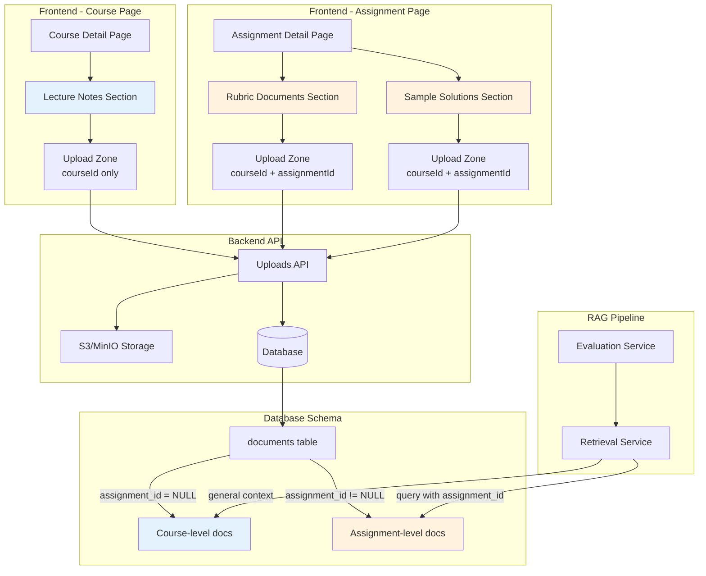
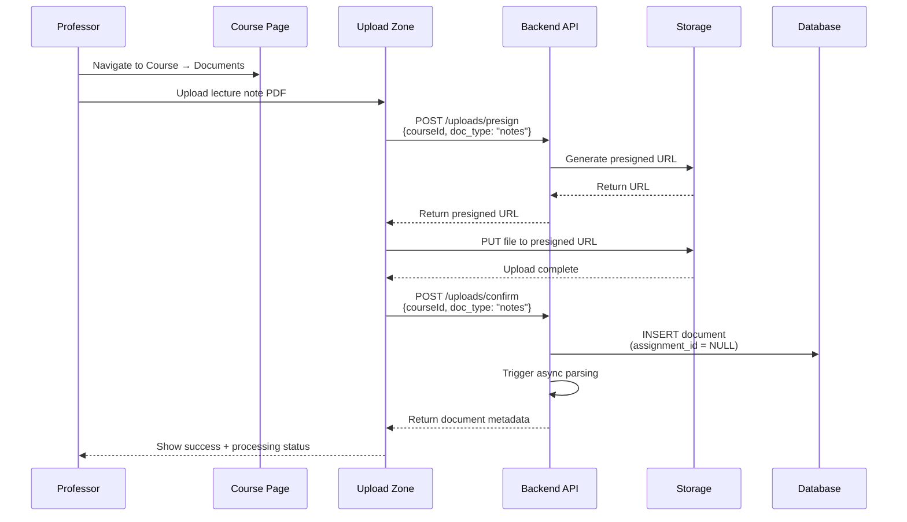
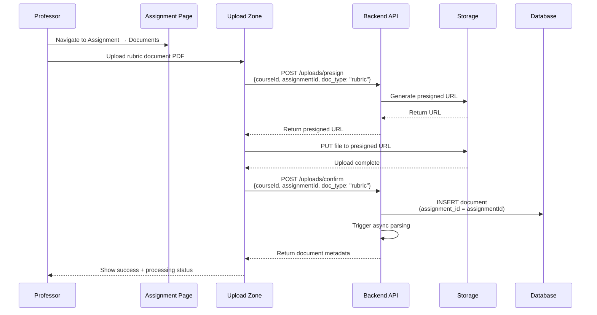
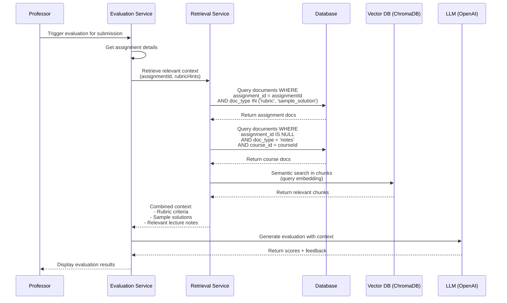
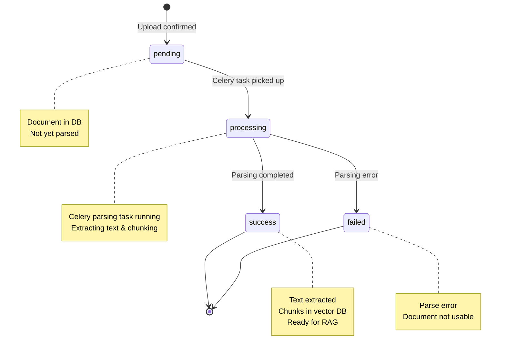

# Document Management Architecture

## Overview
This document explains how document management is organized in GradeAI, aligning the frontend UI with backend data architecture and RAG retrieval logic.

## Document Types and Scope

### Course-Level Documents
- **Type**: Lecture Notes (`doc_type="notes"`)
- **Scope**: Course-wide, available to all assignments
- **Database**: `assignment_id = NULL`
- **UI Location**: Course → Documents tab
- **Use Case**: Course materials, general reference, lecture slides

### Assignment-Level Documents
- **Type 1**: Rubric Documents (`doc_type="rubric"`)
- **Type 2**: Sample Solutions (`doc_type="sample_solution"`)
- **Scope**: Assignment-specific
- **Database**: `assignment_id = <specific_assignment_id>`
- **UI Location**: Assignment → Documents section
- **Use Case**: Grading criteria, example solutions for specific assignments

## Architecture Diagram



## UI Organization

### Before Refactoring ❌
```
Course Page
├── Overview
├── Assignments
├── Students
└── Documents
    ├── Lecture Notes ✓ (course-level)
    ├── Rubric Documents ✗ (should be assignment-level)
    └── Sample Solutions ✗ (should be assignment-level)

Assignment Page
├── Assignment Info
├── Rubric Builder
└── Submissions
```

### After Refactoring ✅
```
Course Page
├── Overview
├── Assignments
├── Students
└── Documents
    └── Lecture Notes ✓ (course-level only)

Assignment Page
├── Assignment Info
├── Rubric Builder
├── Submissions
└── Assignment Documents ✓ (NEW)
    ├── Rubric Documents ✓
    └── Sample Solutions ✓
```

## Document Upload Flow

### Course-Level Upload (Lecture Notes)


### Assignment-Level Upload (Rubric/Sample Solution)


## Document Retrieval in RAG Pipeline

### Evaluation Flow


## Database Schema

### documents table
```sql
CREATE TABLE documents (
    id UUID PRIMARY KEY DEFAULT uuid_generate_v4(),
    file_key VARCHAR NOT NULL,           -- S3 key
    file_name VARCHAR NOT NULL,
    file_size_bytes INTEGER NOT NULL,
    doc_type VARCHAR NOT NULL,           -- 'notes', 'rubric', 'sample_solution'
    parse_status VARCHAR NOT NULL,       -- 'pending', 'processing', 'success', 'failed'
    course_id UUID NOT NULL REFERENCES courses(id),
    assignment_id UUID REFERENCES assignments(id),  -- NULL for course-level docs
    uploaded_by UUID NOT NULL REFERENCES users(id),
    created_at TIMESTAMP NOT NULL DEFAULT NOW(),
    updated_at TIMESTAMP NOT NULL DEFAULT NOW()
);

-- Key constraints:
-- - Lecture notes: assignment_id = NULL
-- - Rubric docs: assignment_id = specific assignment
-- - Sample solutions: assignment_id = specific assignment
```

### Query Examples

**Get course-level documents (Lecture Notes)**
```sql
SELECT * FROM documents 
WHERE course_id = $1 
  AND doc_type = 'notes' 
  AND assignment_id IS NULL;
```

**Get assignment-level documents (Rubric + Samples)**
```sql
SELECT * FROM documents 
WHERE assignment_id = $1 
  AND doc_type IN ('rubric', 'sample_solution');
```

**Get all documents for RAG retrieval**
```sql
-- Get assignment-specific docs
SELECT * FROM documents 
WHERE assignment_id = $1;

-- Plus course-level docs
SELECT * FROM documents 
WHERE course_id = $2 
  AND assignment_id IS NULL 
  AND doc_type = 'notes';
```

## Component Hierarchy

### CourseDetailPage
```typescript
CourseDetailPage
  └── DocumentsTab
      └── DocumentSection (Lecture Notes only)
          ├── DocumentUploadZone (courseId)
          └── DocumentItem[]
```

### AssignmentDetailPage
```typescript
AssignmentDetailPage
  ├── RubricBuilder
  ├── SubmissionsSection
  └── AssignmentDocumentsSection (NEW)
      ├── AssignmentDocumentSection (Rubric Documents)
      │   ├── DocumentUploadZone (courseId + assignmentId)
      │   └── AssignmentDocumentItem[]
      └── AssignmentDocumentSection (Sample Solutions)
          ├── DocumentUploadZone (courseId + assignmentId)
          └── AssignmentDocumentItem[]
```

## API Endpoints Used

### Upload Workflow
1. **POST /api/v1/uploads/presign**
   - Request: `{file_name, content_type, doc_type, course_id, assignment_id?}`
   - Response: `{upload_url, file_key}`
   - Note: `assignment_id` is optional, NULL for course-level docs

2. **PUT {upload_url}** (S3/MinIO)
   - Direct upload to storage

3. **POST /api/v1/uploads/confirm**
   - Request: `{file_key, file_name, file_size_bytes, doc_type, course_id, assignment_id?}`
   - Response: `{id, file_name, parse_status, ...}`

### Document Management
4. **GET /api/v1/uploads/courses/{courseId}/documents**
   - Returns all documents for a course (both NULL and non-NULL assignment_id)
   - Frontend filters by assignment_id for assignment-specific views

5. **GET /api/v1/uploads/{documentId}/status**
   - Returns parse status for polling

6. **DELETE /api/v1/uploads/{documentId}**
   - Deletes document from DB and storage

## Parse Status Lifecycle



## Key Design Decisions

### 1. Why Not Separate Endpoints?
**Decision**: Use single `getCourseDocuments()` endpoint and filter on frontend.

**Rationale**:
- Backend already returns all documents for a course
- Frontend can easily filter by `assignment_id`
- Avoids creating new backend endpoints
- Maintains backward compatibility

### 2. Why Reuse DocumentUploadZone?
**Decision**: Use existing component with optional `assignmentId` prop.

**Rationale**:
- Component already supports `assignmentId`
- Consistent upload UX across pages
- No duplication of upload logic
- Maintains upload progress, error handling, polling

### 3. Why Not Create Assignment Documents Table?
**Decision**: Use single `documents` table with nullable `assignment_id`.

**Rationale**:
- Simpler schema
- Easier to query all documents together
- NULL clearly indicates course-level scope
- Follows existing database design

### 4. Why Show After Rubrics Are Saved?
**Decision**: Only show document sections after rubric exists.

**Rationale**:
- Rubric documents are meaningless without rubric
- Sample solutions should match rubric criteria
- Enforces logical workflow order
- Prevents incomplete assignments

## Benefits of This Architecture

### For Professors
✅ **Clear mental model**: Course materials vs assignment materials  
✅ **Contextual uploads**: Upload assignment-specific docs where they're used  
✅ **Reduced confusion**: No ambiguity about document scope  
✅ **Better organization**: Documents grouped by relevance  

### For System
✅ **Aligned architecture**: UI matches data model and RAG logic  
✅ **Efficient retrieval**: RetrievalService queries correct scope  
✅ **Maintainable code**: Clear separation of concerns  
✅ **No breaking changes**: Backward compatible with existing data  

### For Students
✅ **Relevant grading**: AI uses correct documents for each assignment  
✅ **Fair evaluation**: Sample solutions specific to their assignment  
✅ **Better feedback**: Context from both course and assignment materials  

## Migration Guide

### For New Installations
No migration needed. Documents are organized correctly from the start.

### For Existing Installations with Misplaced Documents

**Step 1: Identify misplaced documents**
```sql
-- Find rubric/sample docs without assignment_id
SELECT id, file_name, doc_type, course_id 
FROM documents 
WHERE doc_type IN ('rubric', 'sample_solution') 
  AND assignment_id IS NULL;
```

**Step 2: Options**
1. **Delete and re-upload** (recommended): Let professors re-upload through new UI
2. **Manual update**: Update assignment_id if you can determine correct assignment
3. **Convert to notes**: Change doc_type to 'notes' if they're course-wide

**Step 3: Verify**
```sql
-- All rubric/sample docs should have assignment_id
SELECT COUNT(*) 
FROM documents 
WHERE doc_type IN ('rubric', 'sample_solution') 
  AND assignment_id IS NULL;
-- Should return 0

-- All notes should NOT have assignment_id
SELECT COUNT(*) 
FROM documents 
WHERE doc_type = 'notes' 
  AND assignment_id IS NOT NULL;
-- Should return 0
```

## Future Enhancements

### Possible Improvements
1. **Bulk upload**: Upload multiple documents at once
2. **Document preview**: Preview PDF/DOCX in browser
3. **Version control**: Track document revisions
4. **Copy between assignments**: Reuse rubric docs across assignments
5. **Templates**: Pre-defined rubric document templates
6. **AI suggestions**: Suggest missing documents based on assignment type

### Scalability Considerations
- Document count per course: Unlimited (pagination if needed)
- Document count per assignment: Unlimited (pagination if needed)
- File size limit: Currently handled by S3/MinIO
- Parse time: Async Celery tasks, no blocking

## Troubleshooting

### Problem: Documents not appearing
**Check**:
1. Parse status: Is document still processing?
2. Assignment ID: Is filter correctly applied?
3. Permissions: Does user have access to course/assignment?
4. Query cache: Try refetch/hard refresh

### Problem: Upload fails
**Check**:
1. File type: Is it .pdf, .docx, or .txt?
2. File size: Within limits?
3. Network: Connection to S3/MinIO?
4. Backend logs: Any error messages?

### Problem: Parse never completes
**Check**:
1. Celery workers: Are they running?
2. Redis: Is it accessible?
3. Backend logs: Any parsing errors?
4. File content: Is it a valid, readable file?

## References

- [RAG Architecture Documentation](./RAG_ARCHITECTURE.md)
- [Database Schema](./DATABASE.md)
- [API Documentation](./API.md)
- [Refactoring Summary](../DOCUMENT_MANAGEMENT_REFACTORING.md)
