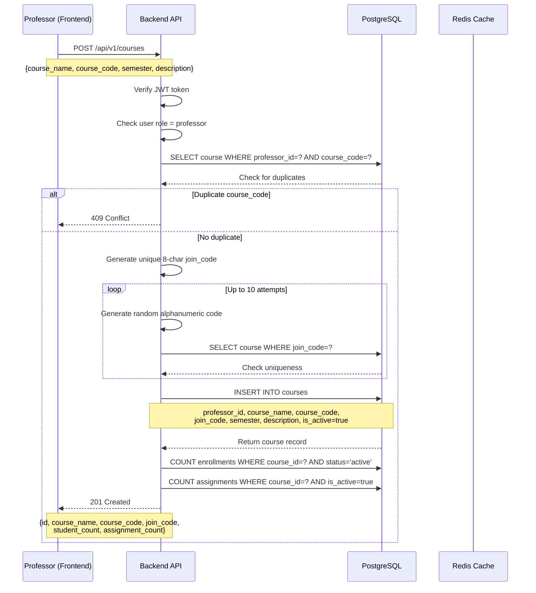
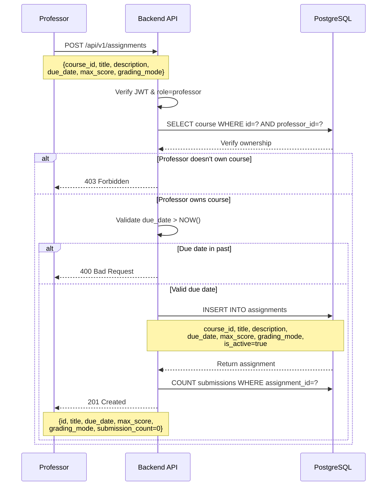
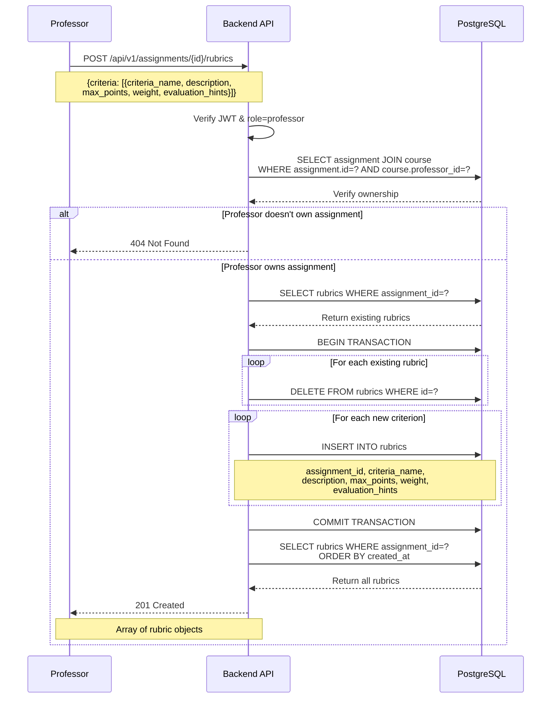
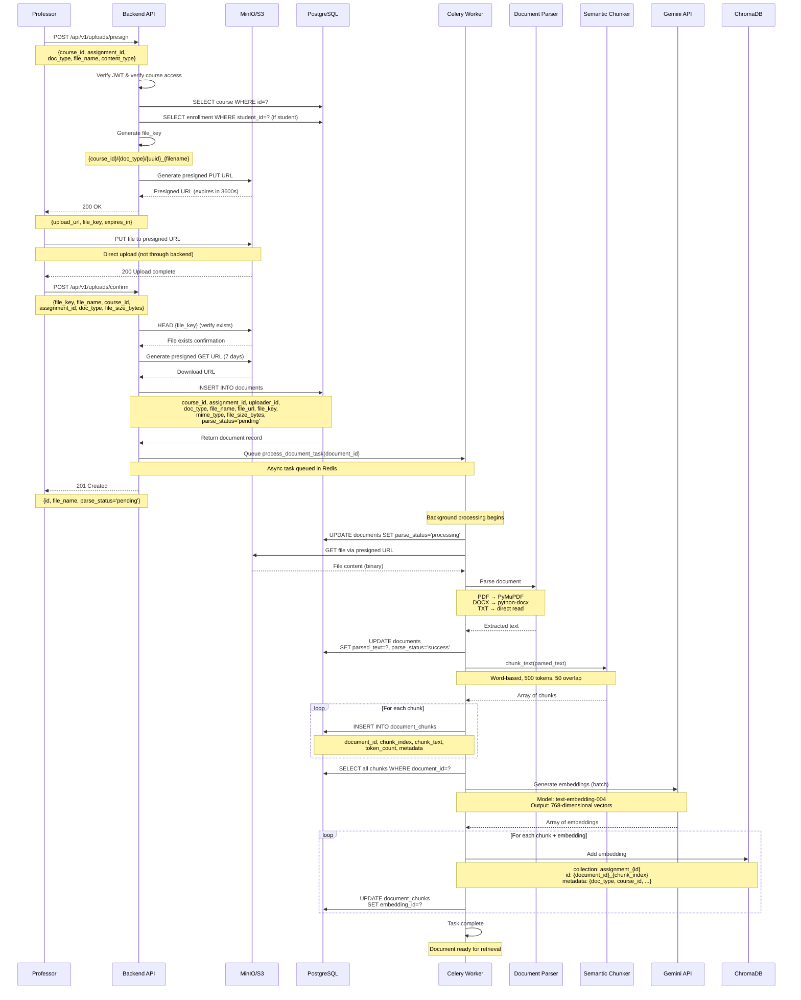
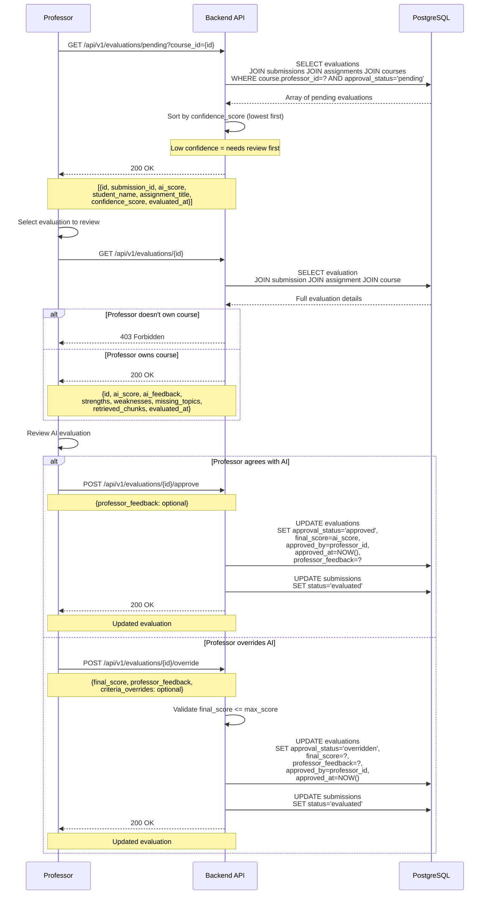
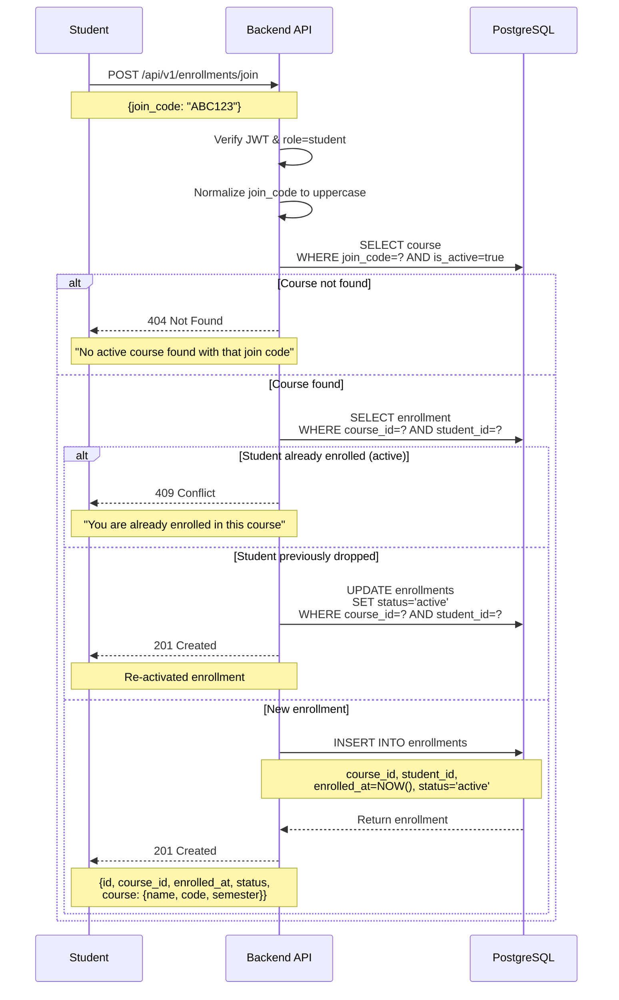
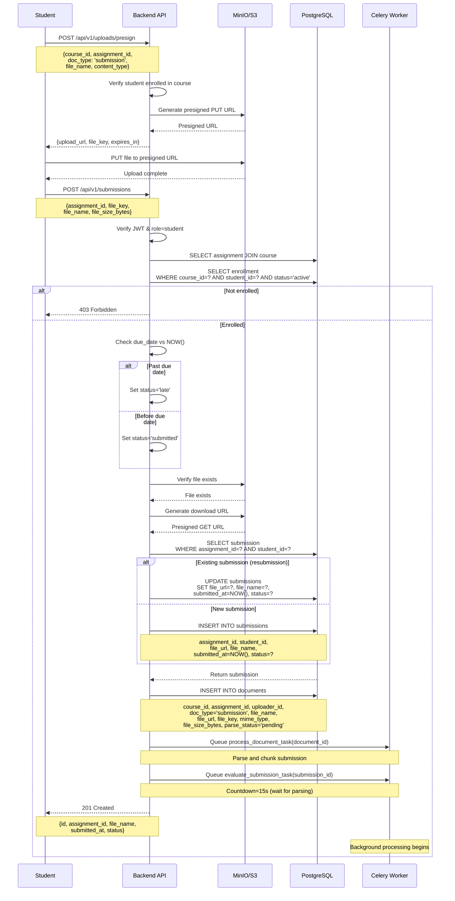
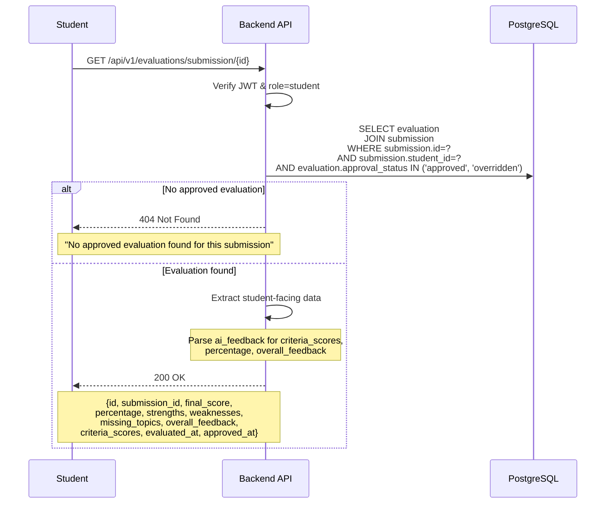
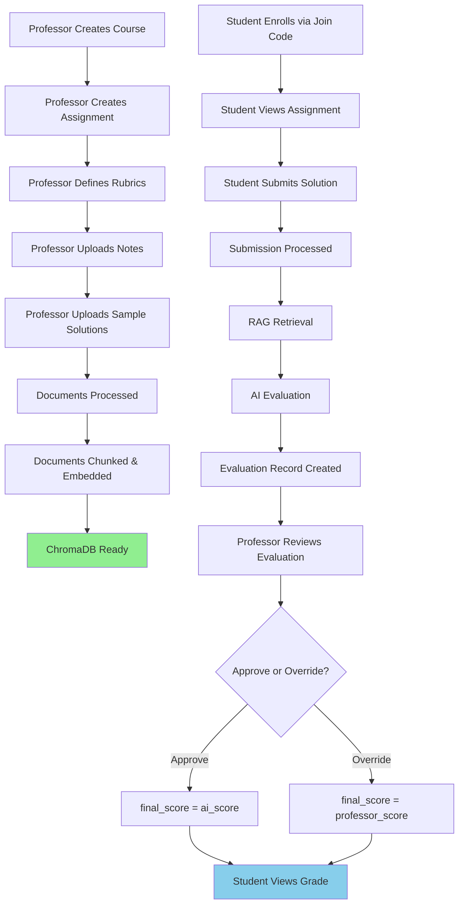

# Project Flow Documentation

## Overview

This document describes every workflow in the GradeAI system from end to end, covering the complete lifecycle from course creation to final grade delivery. Each workflow is documented with **Mermaid sequence diagrams**, exact API endpoints, database operations, and business logic.

The system has three primary user journeys:
1. **Professor Journey**: Create → Configure → Upload → Review → Approve
2. **Student Journey**: Enroll → Submit → View Results
3. **Backend Journey**: Process → Chunk → Embed → Retrieve → Evaluate

---

## Table of Contents

1. [System Actors](#system-actors)
2. [Professor Workflows](#professor-workflows)
   - [Course Creation](#1-course-creation-workflow)
   - [Assignment Creation](#2-assignment-creation-workflow)
   - [Rubric Definition](#3-rubric-definition-workflow)
   - [Document Upload (Notes, Samples)](#4-document-upload-workflow)
   - [Evaluation Review](#5-evaluation-review-workflow)
3. [Student Workflows](#student-workflows)
   - [Course Enrollment](#6-course-enrollment-workflow)
   - [Assignment Submission](#7-assignment-submission-workflow)
   - [Grade Viewing](#8-grade-viewing-workflow)
4. [Backend Processing Workflows](#backend-processing-workflows)
   - [Document Processing Pipeline](#9-document-processing-pipeline)
   - [Submission Evaluation Pipeline](#10-submission-evaluation-pipeline)
5. [Complete End-to-End Flow](#complete-end-to-end-flow)
6. [Error Handling and Edge Cases](#error-handling-and-edge-cases)

---

## System Actors

### 1. Users

**Professor**:
- Creates and manages courses
- Creates assignments with rubrics
- Uploads course materials (lecture notes, sample solutions, rubric documents)
- Reviews and approves/overrides AI evaluations
- Views student submissions and analytics

**Student**:
- Enrolls in courses using join codes
- Views assignments and rubrics
- Submits assignment solutions
- Views approved grades and feedback

**Admin** (not fully implemented):
- System-level management
- User management
- Audit log access

### 2. System Components

**Frontend** (React + Vite):
- User interface for all interactions
- Located in `frontend/src/`

**Backend API** (FastAPI):
- RESTful API endpoints
- Located in `backend/app/api/v1/endpoints/`

**PostgreSQL**:
- Relational database for all persistent data
- Models in `backend/app/models/`

**Celery Workers**:
- Asynchronous task processing
- Tasks in `backend/app/tasks/grading.py`

**Redis** (see `app/core/config.py`):
- DB 0: Application — JWT blacklist, refresh tokens, cache
- DB 1: Celery message broker / task queue
- DB 2: Celery result backend

**MinIO/S3**:
- Object storage for uploaded files
- Service in `backend/app/services/s3_service.py`

**ChromaDB**:
- Vector database for document embeddings
- Client in `backend/app/infrastructure/chromadb_client.py`

**Google Gemini**:
- Embedding generation (text-embedding-004)
- AI evaluation (gemini-1.5-pro)

---

## Professor Workflows

### 1. Course Creation Workflow

**Goal**: Professor creates a new course with a unique join code for student enrollment.

**Endpoint**: `POST /api/v1/courses`

**Implementation**: `backend/app/api/v1/endpoints/courses.py:create_course()`



**Key Points**:
- **Unique Join Code**: 6-character uppercase alphanumeric string (e.g., "AB12CD")
- **Duplicate Prevention**: `uq_courses_professor_course_code` constraint prevents same professor from creating duplicate course codes
- **Soft Delete**: `is_active=true` allows deactivation instead of deletion
- **Initial State**: New course has 0 students and 0 assignments

**Business Rules**:
1. Only professors can create courses
2. Professor can have multiple courses with same code in different semesters
3. Join code must be globally unique across all courses
4. Course code must be unique per professor


---

### 2. Assignment Creation Workflow

**Goal**: Professor creates a graded assignment within a course.

**Endpoint**: `POST /api/v1/assignments`

**Implementation**: `backend/app/api/v1/endpoints/assignments.py:create_assignment()`



**Key Points**:
- **Grading Modes**:
  - `auto`: AI evaluates automatically (no professor review)
  - `manual`: Professor grades manually (no AI)
  - `hybrid`: AI evaluates, professor reviews (most common)
- **Due Date**: Must be in future, stored with timezone (UTC)
- **Max Score**: Must match sum of rubric max_points (validated later)
- **Initial State**: No submissions, no rubrics yet

**Business Rules**:
1. Professor must own the course
2. Due date must be in future
3. `max_score` typically matches sum of rubric points
4. Once created, assignment requires rubrics before submissions can be evaluated


---

### 3. Rubric Definition Workflow

**Goal**: Professor defines grading criteria for an assignment.

**Endpoint**: `POST /api/v1/assignments/{assignment_id}/rubrics`

**Implementation**: `backend/app/api/v1/endpoints/assignments.py:create_rubrics()`



**Key Points**:
- **Replace Operation**: Deletes all existing rubrics, then creates new ones (atomic operation)
- **Weight**: Decimal value typically summing to 1.0 (e.g., 0.4 for 40% weight)
- **Evaluation Hints**: Optional text injected into AI evaluation prompt
- **Max Points**: Should sum to assignment's `max_score`

**Example Rubric**:
```json
{
  "criteria": [
    {
      "criteria_name": "Code Correctness",
      "description": "Program produces correct output",
      "max_points": 40.00,
      "weight": 0.40,
      "evaluation_hints": "Check if all test cases pass"
    },
    {
      "criteria_name": "Code Quality",
      "description": "Clean, readable, well-structured code",
      "max_points": 30.00,
      "weight": 0.30,
      "evaluation_hints": "Evaluate variable names, comments, structure"
    },
    {
      "criteria_name": "Documentation",
      "description": "Comments and docstrings",
      "max_points": 30.00,
      "weight": 0.30,
      "evaluation_hints": "Check function docstrings and inline comments"
    }
  ]
}
```

**Business Rules**:
1. Rubrics are replaced atomically (all-or-nothing)
2. `evaluation_hints` guide the AI evaluator (see `backend/app/rag/evaluator.py:_build_evaluation_prompt()`)
3. Weights should sum to 1.0 (validated in application logic)
4. Max points should sum to assignment's `max_score`


---

### 4. Document Upload Workflow

**Goal**: Professor uploads course materials (lecture notes, sample solutions, rubric documents) for RAG context.

**Endpoints**:
- `POST /api/v1/uploads/presign` - Generate presigned upload URL
- `POST /api/v1/uploads/confirm` - Confirm upload and create document record

**Implementation**: `backend/app/api/v1/endpoints/uploads.py`



**Key Points**:
- **Presigned URLs**: Direct upload to MinIO bypasses backend (scalability)
- **Document Types**:
  - `notes`: Lecture material
  - `sample_solution`: Reference submissions
  - `rubric`: Detailed grading criteria (not yet fully used in RAG)
- **Async Processing**: Upload confirmation returns immediately, processing happens in background
- **Parse Status Lifecycle**: `pending` → `processing` → `success`/`failed`

**Business Rules**:
1. Allowed content types: `application/pdf`, `application/vnd.openxmlformats-officedocument.wordprocessingml.document`, `text/plain`
2. Presigned upload URL expires in 1 hour
3. Presigned download URL expires in 7 days
4. Failed parsing sets `parse_status='failed'` but preserves file
5. Each document is chunked and embedded for RAG retrieval

**Implementation Details**:
- Upload presign: `backend/app/api/v1/endpoints/uploads.py:presign_upload()`
- Upload confirm: `backend/app/api/v1/endpoints/uploads.py:confirm_upload()`
- Document processing: `backend/app/tasks/grading.py:process_document_task()`
- Parsing: `backend/app/rag/parsers.py:UnifiedDocumentParser`
- Chunking: `backend/app/rag/chunker.py:SemanticChunker`
- Embedding: `backend/app/rag/embeddings.py:GeminiEmbeddings`


---

### 5. Evaluation Review Workflow

**Goal**: Professor reviews AI-generated evaluations and either approves or overrides them.

**Endpoints**:
- `GET /api/v1/evaluations/pending` - List pending evaluations
- `GET /api/v1/evaluations/{evaluation_id}` - Get evaluation details
- `POST /api/v1/evaluations/{evaluation_id}/approve` - Approve AI score
- `POST /api/v1/evaluations/{evaluation_id}/override` - Override with manual score

**Implementation**: `backend/app/api/v1/endpoints/evaluations.py`



**Key Points**:
- **Approval Status Lifecycle**: `pending` → `approved`/`overridden`
- **Confidence Score**: Low confidence evaluations shown first (need most review)
- **Final Score**:
  - `approved`: final_score = ai_score
  - `overridden`: final_score = professor's score
- **Immutability**: Once approved/overridden, evaluation cannot be changed

**Business Rules**:
1. Only professor who owns the course can review evaluations
2. `final_score` cannot exceed `assignment.max_score`
3. Professor can provide additional feedback when approving
4. Professor must provide feedback when overriding
5. Once approved, students can view their grades

**Implementation**: `backend/app/api/v1/endpoints/evaluations.py`


---

## Student Workflows

### 6. Course Enrollment Workflow

**Goal**: Student joins a course using a professor-provided join code.

**Endpoint**: `POST /api/v1/enrollments/join`

**Implementation**: `backend/app/api/v1/endpoints/courses.py:join_course()`



**Key Points**:
- **Join Code**: Case-insensitive (normalized to uppercase)
- **Re-enrollment**: If student previously dropped, reactivates enrollment
- **Unique Constraint**: `uq_enrollments_course_student` prevents duplicate active enrollments

**Business Rules**:
1. Only students can join courses
2. Join code must match an active course
3. Student cannot be enrolled in the same course twice
4. Dropping and re-joining reuses the same enrollment record

**Implementation**: `backend/app/api/v1/endpoints/courses.py:join_course()`


---

### 7. Assignment Submission Workflow

**Goal**: Student uploads and submits an assignment solution.

**Endpoints**:
- `POST /api/v1/uploads/presign` - Get upload URL
- `POST /api/v1/submissions` - Create submission record

**Implementation**:
- Upload: `backend/app/api/v1/endpoints/uploads.py:presign_upload()`
- Submission: `backend/app/api/v1/endpoints/submissions.py:create_submission()`



**Key Points**:
- **Late Submissions**: Automatically flagged if submitted after `assignment.due_date`
- **Resubmissions**: Updates existing submission record
- **Async Evaluation**: Queued with 15-second delay to allow document processing
- **Status Lifecycle**: `submitted`/`late` → `evaluating` → `evaluated`

**Business Rules**:
1. Student must be actively enrolled in course
2. Late submissions are accepted but flagged
3. Resubmissions are allowed (overwrites previous submission)
4. File must exist in MinIO before creating submission record
5. AI evaluation triggered automatically after submission

**Implementation**:
- `backend/app/api/v1/endpoints/submissions.py:create_submission()`
- Evaluation trigger: `backend/app/tasks/grading.py:evaluate_submission_task()`


---

### 8. Grade Viewing Workflow

**Goal**: Student views their approved grade and feedback.

**Endpoint**: `GET /api/v1/evaluations/submission/{submission_id}`

**Implementation**: `backend/app/api/v1/endpoints/evaluations.py:get_student_evaluation()`



**Response Structure**:
```json
{
  "id": "eval-uuid",
  "submission_id": "sub-uuid",
  "final_score": 85.50,
  "percentage": 85.50,
  "strengths": [
    "Well-structured code",
    "Comprehensive test cases",
    "Good documentation"
  ],
  "weaknesses": [
    "Missing edge case handling",
    "Some variable names unclear"
  ],
  "missing_topics": [
    "Error handling for invalid input"
  ],
  "overall_feedback": "Solid implementation with good testing...",
  "criteria_scores": [
    {
      "criteria_name": "Code Correctness",
      "score": 35.00,
      "max_points": 40.00,
      "feedback": "All main test cases pass..."
    },
    {
      "criteria_name": "Code Quality",
      "score": 25.00,
      "max_points": 30.00,
      "feedback": "Clean structure, readable code..."
    },
    {
      "criteria_name": "Documentation",
      "score": 25.50,
      "max_points": 30.00,
      "feedback": "Good docstrings, inline comments..."
    }
  ],
  "evaluated_at": "2026-07-10T10:30:00Z",
  "approved_at": "2026-07-10T14:45:00Z"
}
```

**Key Points**:
- **Pending Evaluations**: Not shown to students (404)
- **Criteria Scores**: Per-rubric breakdown of score and feedback
- **Strengths/Weaknesses**: Arrays extracted from AI response
- **Missing Topics**: AI-identified gaps in submission

**Business Rules**:
1. Student can only view their own submissions
2. Only approved or overridden evaluations are visible
3. Pending evaluations return 404 (not "pending", to avoid confusion)
4. Professor feedback overrides AI feedback if provided

**Implementation**: `backend/app/api/v1/endpoints/evaluations.py:get_student_evaluation()`


---

## Backend Processing Workflows

### 9. Document Processing Pipeline

**Goal**: Parse, chunk, and embed uploaded documents for RAG retrieval.

**Implementation**: `backend/app/tasks/grading.py:process_document_task()`

See [RAG_ARCHITECTURE.md](./RAG_ARCHITECTURE.md) for complete details.

**Summary**:
1. Download file from MinIO
2. Parse document (PDF/DOCX/TXT)
3. Chunk text semantically (500 tokens, 50 overlap)
4. Generate embeddings via Gemini (text-embedding-004)
5. Store in ChromaDB with metadata
6. Update document_chunks table with embedding IDs

---

### 10. Submission Evaluation Pipeline

**Goal**: Use RAG to evaluate student submissions against rubrics and course materials.

**Implementation**: `backend/app/tasks/grading.py:evaluate_submission_task()`

See [RAG_ARCHITECTURE.md](./RAG_ARCHITECTURE.md) sections 11-17 for complete details.

**Summary**:
1. Parse submission document
2. Retrieve relevant chunks from ChromaDB (notes, samples, rubrics)
3. Build evaluation prompt with rubrics and context
4. Call Gemini 1.5 Pro for evaluation
5. Parse JSON response (scores, feedback, strengths, weaknesses)
6. Create evaluation record with `approval_status='pending'`
7. Update submission status to `evaluating` → `evaluated`

**Retrieval Strategy** (see `backend/app/rag/retrieval.py:RetrievalService`):
- Sample solutions: top 10 chunks
- Lecture notes: top 15 chunks
- Rubric documents: top 5 chunks (not fully implemented)
- Similarity search via ChromaDB cosine distance

**Evaluation Prompt** (see `backend/app/rag/evaluator.py:_build_evaluation_prompt()`):
```
SYSTEM: You are an expert grading assistant...

USER:
# Assignment: {title}
# Student Submission:
{submission_text}

# Grading Rubrics:
{rubrics with hints}

# Reference Materials:
{retrieved chunks}

Evaluate and return JSON with:
- criteria_scores (per rubric)
- overall_score
- strengths
- weaknesses
- missing_topics
- confidence_score
```

---

## Complete End-to-End Flow



**Timeline**:
1. **Setup Phase** (Professor): 10-30 minutes
   - Create course: 2 minutes
   - Create assignment with rubrics: 5-10 minutes
   - Upload 3-5 documents: 10-20 minutes
   - Document processing: 5-15 minutes (async)

2. **Submission Phase** (Student): 5-10 minutes
   - Enroll in course: 1 minute
   - Submit assignment: 5 minutes
   - AI evaluation: 2-5 minutes (async)

3. **Review Phase** (Professor): 2-5 minutes per submission
   - Review evaluation: 1-2 minutes
   - Approve or override: 1-3 minutes

4. **Grade Delivery** (Student): Immediate
   - View grade and feedback: Real-time after approval

---

## Error Handling and Edge Cases

### Document Processing Failures

**Scenario**: PDF parsing fails due to corrupted file

**Handling**:
1. Set `parse_status='failed'`
2. Log error to structlog
3. Retry up to 3 times with exponential backoff
4. If all retries fail, preserve file but mark as failed
5. Professor can delete and re-upload

**Implementation**: `backend/app/tasks/grading.py:process_document_task()`

---

### Submission Evaluation Failures

**Scenario**: Gemini API returns invalid JSON or times out

**Handling**:
1. Retry up to 3 times with exponential backoff (5s, 10s, 20s)
2. Fallback evaluation if all retries fail:
   - Generate basic score (50% of max_score)
   - Feedback: "Automatic evaluation unavailable"
   - Confidence: 0.0 (flags for manual review)
3. Create evaluation record with low confidence
4. Professor reviews and overrides

**Implementation**: `backend/app/rag/evaluator.py:RubricEvaluator.evaluate()`

---

### Late Submissions

**Scenario**: Student submits after due date

**Handling**:
1. Submission status set to `late` instead of `submitted`
2. Evaluation proceeds normally
3. Professor sees "late" flag when reviewing
4. Professor decides whether to apply late penalty

**Implementation**: `backend/app/api/v1/endpoints/submissions.py:create_submission()`

---

### Resubmissions

**Scenario**: Student submits multiple times

**Current Behavior**:
- Overwrites previous submission
- Previous evaluation is deleted (CASCADE)
- New evaluation triggered automatically

**Future Enhancement**: Track submission history

**Implementation**: `backend/app/api/v1/endpoints/submissions.py:create_submission()`

---

### Missing Rubrics

**Scenario**: Assignment has no rubrics defined

**Handling**:
1. Evaluation task fails with error
2. No evaluation record created
3. Submission remains in `submitted` status
4. Professor must define rubrics, then manually trigger evaluation

**Prevention**: Frontend validates rubrics exist before allowing submissions

---

### ChromaDB Retrieval Failures

**Scenario**: ChromaDB is down or returns no chunks

**Handling**:
1. Evaluation proceeds with empty context
2. Gemini evaluates based only on rubrics and submission
3. Lower confidence score (context_available=false)
4. Professor reviews flagged low-confidence evaluation

**Implementation**: `backend/app/rag/retrieval.py:RetrievalService.retrieve_context()`

---

## Related Documentation

- **RAG Pipeline Details**: See [RAG_ARCHITECTURE.md](./RAG_ARCHITECTURE.md)
- **Database Schema**: See [DATABASE.md](./DATABASE.md)
- **API Endpoints**: See [API.md](./API.md) (pending)
- **System Architecture**: See [ARCHITECTURE.md](./ARCHITECTURE.md)

---

**Last Updated**: 2026-07-11  
**Version**: 1.0
