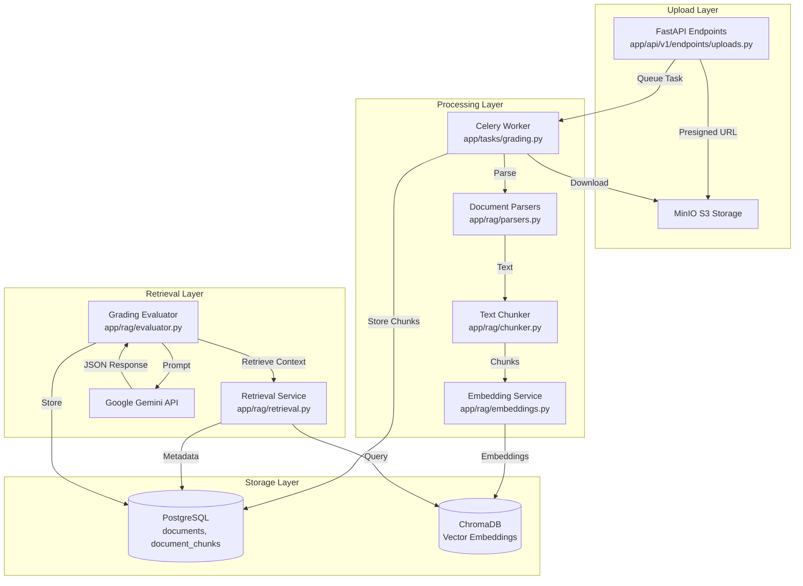
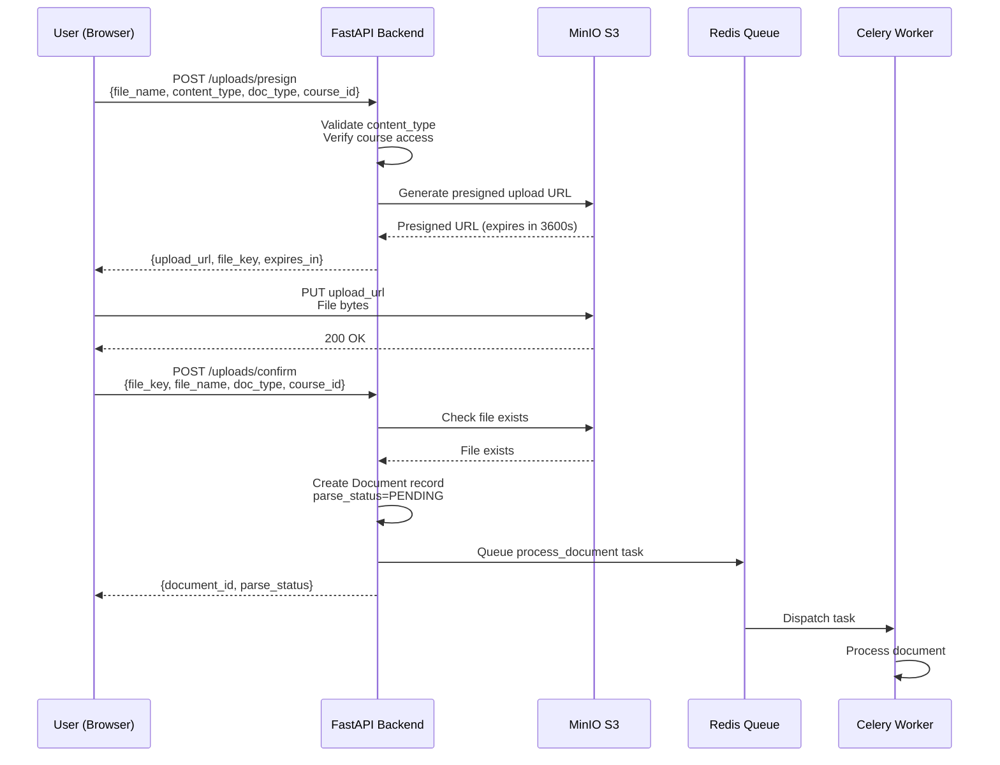
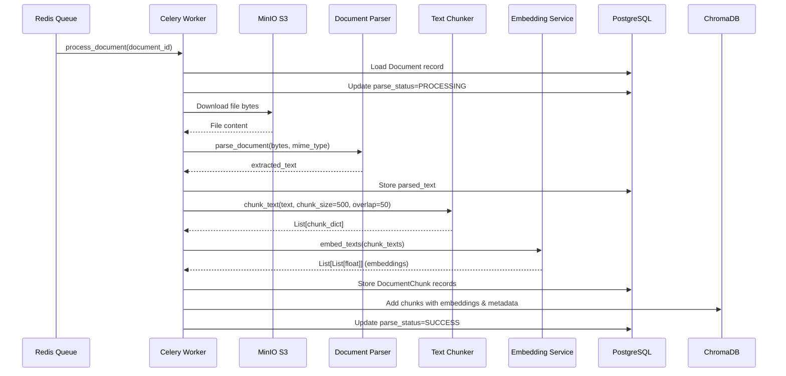
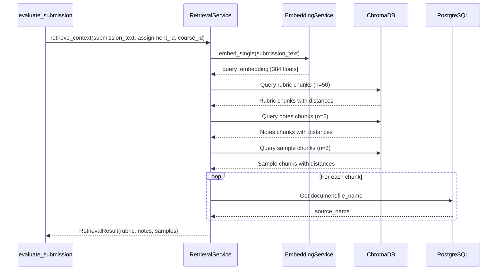

# RAG Architecture

**Retrieval-Augmented Generation Pipeline for AI-Powered Grading**

## Table of Contents

1. [Overview](#overview)
2. [Architecture Components](#architecture-components)
3. [Document Upload Flow](#document-upload-flow)
4. [Document Processing Pipeline](#document-processing-pipeline)
5. [Text Parsing](#text-parsing)
6. [Text Chunking](#text-chunking)
7. [Embedding Generation](#embedding-generation)
8. [ChromaDB Storage](#chromadb-storage)
9. [Metadata Schema](#metadata-schema)
10. [Retrieval Strategy](#retrieval-strategy)
11. [Similarity Search](#similarity-search)
12. [Context Ranking](#context-ranking)
13. [Prompt Construction](#prompt-construction)
14. [Gemini Evaluation](#gemini-evaluation)
15. [JSON Response Parsing](#json-response-parsing)
16. [Evaluation Storage](#evaluation-storage)
17. [Error Handling](#error-handling)
18. [Performance Considerations](#performance-considerations)
19. [Known Limitations](#known-limitations)

## Overview

The GradeAI RAG (Retrieval-Augmented Generation) system processes academic documents, stores them as vector embeddings, retrieves relevant context using semantic search, and uses that context to grade student submissions with Google Gemini.

### Key Design Principles

1. **Asynchronous Processing**: All document processing happens in background Celery tasks
2. **Semantic Search**: Uses vector similarity rather than keyword matching
3. **Context Assembly**: Combines rubrics, course notes, and sample solutions
4. **Structured Output**: Gemini returns JSON for predictable parsing
5. **Human-in-the-Loop**: Professors review and can override AI grades

### RAG Pipeline Stages


## Architecture Components

### Component Diagram



### File Locations

| Component | File Path | Primary Class/Function |
|-----------|-----------|----------------------|
| Document Upload | `app/api/v1/endpoints/uploads.py` | `presign_upload()`, `confirm_upload()` |
| Document Processing | `app/tasks/grading.py` | `process_document()` |
| Text Parsing | `app/rag/parsers.py` | `parse_pdf()`, `parse_docx()`, `parse_txt()` |
| Text Chunking | `app/rag/chunker.py` | `chunk_text()` |
| Embedding Generation | `app/rag/embeddings.py` | `EmbeddingService.embed_texts()` |
| ChromaDB Client | `app/infrastructure/chromadb_client.py` | `ChromaDBClient` |
| Context Retrieval | `app/rag/retrieval.py` | `RetrievalService.retrieve_context()` |
| AI Evaluation | `app/rag/evaluator.py` | `GradingEvaluator.evaluate()` |
| Submission Grading | `app/tasks/grading.py` | `evaluate_submission()` |


## Document Upload Flow

### Two-Phase Upload Process

GradeAI uses a two-phase upload process to offload file transfer from the backend:



### Phase 1: Presign Upload URL

**File**: `app/api/v1/endpoints/uploads.py`
**Function**: `presign_upload()`
**Lines**: 75-125

```python
@router.post("/presign", response_model=PresignResponse)
async def presign_upload(
    payload: PresignRequest,
    current_user: User = Depends(get_current_user),
    db: AsyncSession = Depends(get_db),
    settings: Settings = Depends(get_settings),
) -> PresignResponse:
```

**Request Schema**:
```python
class PresignRequest(BaseModel):
    file_name: str = Field(min_length=1, max_length=512)
    content_type: str = Field(min_length=1, max_length=127)
    doc_type: DocumentType  # rubric|notes|sample_solution|submission
    course_id: uuid.UUID
    assignment_id: Optional[uuid.UUID] = None  # Required for rubric/sample/submission
```

**Validation Steps**:

1. **Content Type Validation**:
```python
ALLOWED_CONTENT_TYPES = {
    "application/pdf",
    "application/vnd.openxmlformats-officedocument.wordprocessingml.document",
    "text/plain",
}

if payload.content_type not in ALLOWED_CONTENT_TYPES:
    raise HTTPException(status_code=400, detail="Content type not allowed")
```

2. **Course Access Verification**:
```python
async def _verify_course_access(course_id: UUID, user: User, db: AsyncSession) -> Course:
    # Professor owns course OR student is enrolled
```

3. **File Key Generation**:
```python
file_uuid = uuid.uuid4()
file_key = f"{payload.course_id}/{payload.doc_type.value}/{file_uuid}_{payload.file_name}"
# Example: "123e4567.../notes/987f6543..._lecture1.pdf"
```

4. **Presigned URL Generation**:
```python
s3_service = get_s3_service(settings)
upload_url = s3_service.generate_presigned_upload_url(
    file_key=file_key,
    content_type=payload.content_type,
    expires=3600,  # 1 hour
)
```

**S3Service Implementation**: `app/services/s3_service.py`
```python
def generate_presigned_upload_url(
    self, file_key: str, content_type: str, expires: int = 3600
) -> str:
    return self._presign_client.generate_presigned_url(
        "put_object",
        Params={
            "Bucket": self.bucket,
            "Key": file_key,
            "ContentType": content_type,
        },
        ExpiresIn=expires,
    )
```

**Response**:
```json
{
  "upload_url": "http://localhost:9000/gradeai-uploads/123.../notes/987...?X-Amz-Algorithm=...",
  "file_key": "123e4567.../notes/987f6543..._lecture1.pdf",
  "expires_in": 3600
}
```


### Phase 2: Confirm Upload

**File**: `app/api/v1/endpoints/uploads.py`
**Function**: `confirm_upload()`
**Lines**: 128-201

```python
@router.post("/confirm", response_model=DocumentOut, status_code=201)
async def confirm_upload(
    payload: ConfirmUploadRequest,
    current_user: User = Depends(get_current_user),
    db: AsyncSession = Depends(get_db),
    settings: Settings = Depends(get_settings),
) -> DocumentOut:
```

**Request Schema**:
```python
class ConfirmUploadRequest(BaseModel):
    file_key: str = Field(min_length=1, max_length=2048)
    file_name: str = Field(min_length=1, max_length=512)
    file_size_bytes: int = Field(gt=0)
    doc_type: DocumentType
    course_id: uuid.UUID
    assignment_id: Optional[uuid.UUID] = None
```

**Processing Steps**:

1. **Verify File Exists in S3**:
```python
s3_service = get_s3_service(settings)
if not s3_service.file_exists(payload.file_key):
    raise HTTPException(status_code=404, detail="File not found in storage")
```

2. **Determine MIME Type**:
```python
mime_type = "application/octet-stream"
if payload.file_name.lower().endswith(".pdf"):
    mime_type = "application/pdf"
elif payload.file_name.lower().endswith(".docx"):
    mime_type = "application/vnd.openxmlformats-officedocument.wordprocessingml.document"
elif payload.file_name.lower().endswith(".txt"):
    mime_type = "text/plain"
```

3. **Generate Download URL**:
```python
file_url = s3_service.generate_presigned_download_url(payload.file_key, expires=86400)
# Valid for 24 hours
```

4. **Create Document Record**:
```python
document = Document(
    course_id=payload.course_id,
    assignment_id=payload.assignment_id,  # Nullable
    uploader_id=current_user.id,
    doc_type=payload.doc_type,
    file_name=payload.file_name,
    file_url=file_url,
    file_key=payload.file_key,
    mime_type=mime_type,
    file_size_bytes=payload.file_size_bytes,
    parse_status=ParseStatus.PENDING,  # Initial state
)
db.add(document)
await db.commit()
```

5. **Queue Background Processing**:
```python
try:
    process_document.delay(str(document.id))
except Exception as exc:
    logger.error("failed_to_queue_document_processing", 
                 document_id=str(document.id), error=str(exc))
    # Don't fail request if queue is down
```

**Important Design Decision**: Document processing is queued but not awaited. The API returns immediately with `parse_status=PENDING`. Clients must poll `/uploads/{document_id}/status` to check progress.


## Document Processing Pipeline

### Complete Processing Flow



### Celery Task Definition

**File**: `app/tasks/grading.py`
**Function**: `process_document()`
**Lines**: 173-340

```python
@celery_app.task(name="gradeai.process_document", bind=True, max_retries=3)
def process_document(self, document_id: str) -> dict:
    """
    Process an uploaded document through the complete pipeline:
    1. Download from S3
    2. Extract text based on file type (PDF/DOCX/TXT)
    3. Chunk the text
    4. Generate embeddings
    5. Store chunks in database
    6. Store embeddings in ChromaDB
    7. Update document parse_status
    """
```

**Task Configuration**:
- **Name**: `gradeai.process_document`
- **Max Retries**: 3
- **Bind**: True (access to `self` for retry logic)
- **Retry Schedule**: Exponential backoff (30s, 60s, 120s)

### Step-by-Step Execution

#### Step 1: Load Document and Update Status

```python
with get_sync_db() as db:
    document = db.query(Document).filter(Document.id == uuid.UUID(document_id)).first()
    
    if not document:
        logger.error("document_not_found", document_id=document_id)
        raise ValueError(f"Document {document_id} not found")
    
    # Mark as processing
    document.parse_status = ParseStatus.PROCESSING
    db.commit()
    
    # Extract metadata
    file_key = document.file_key
    mime_type = document.mime_type
    course_id = document.course_id
    assignment_id = document.assignment_id
    doc_type = document.doc_type
```

**Database Session**: Uses `get_sync_db()` from `app/db/sync_session.py` because Celery tasks cannot use async operations.

```python
@contextmanager
def get_sync_db() -> Generator[Session, None, None]:
    SessionLocal = get_sync_session_factory()
    session = SessionLocal()
    try:
        yield session
        session.commit()
    except Exception:
        session.rollback()
        raise
    finally:
        session.close()
```


#### Step 2: Download File from S3

```python
s3_service = S3Service(settings)
file_bytes = _download_from_s3(s3_service, file_key)

logger.info("file_downloaded", document_id=document_id, size_bytes=len(file_bytes))
```

**Helper Function**: `_download_from_s3()` (Lines 343-365)

```python
def _download_from_s3(s3_service: S3Service, file_key: str) -> bytes:
    try:
        response = s3_service._client.get_object(
            Bucket=s3_service.bucket,
            Key=file_key,
        )
        file_bytes = response['Body'].read()
        return file_bytes
    except Exception as exc:
        logger.error("s3_download_failed", file_key=file_key, error=str(exc))
        raise
```

**S3 File Key Examples**:
- Notes: `123e4567.../notes/987f6543..._lecture1.pdf`
- Rubric: `123e4567.../rubric/abc12345..._rubric_hw1.docx`
- Sample: `123e4567.../sample_solution/def67890..._solution.pdf`
- Submission: `123e4567.../submission/ghi11121..._student_hw1.pdf`

## Text Parsing

### Parser Router

**File**: `app/rag/parsers.py`
**Function**: `parse_document()` (Lines 139-151)

```python
def parse_document(file_bytes: bytes, mime_type: str) -> str:
    mime_type = mime_type.lower()
    
    if mime_type == "application/pdf":
        return parse_pdf(file_bytes)
    elif mime_type == "application/vnd.openxmlformats-officedocument.wordprocessingml.document":
        return parse_docx(file_bytes)
    elif mime_type == "text/plain":
        return parse_txt(file_bytes)
    else:
        raise ValueError(f"Unsupported MIME type: {mime_type}")
```

### PDF Parsing

**Function**: `parse_pdf()` (Lines 16-45)

```python
def parse_pdf(file_bytes: bytes) -> str:
    try:
        text_parts = []
        with pdfplumber.open(BytesIO(file_bytes)) as pdf:
            for page_num, page in enumerate(pdf.pages, 1):
                page_text = page.extract_text()
                if page_text:
                    text_parts.append(page_text)
        
        if not text_parts:
            logger.warning("pdf_no_text_extracted")
            return ""
        
        full_text = "\n\n".join(text_parts)
        full_text = _clean_text(full_text)
        
        # Remove page numbers pattern (Page X of Y, Page X, etc.)
        full_text = re.sub(r'\bPage\s+\d+\s*(of\s+\d+)?\b', '', full_text, 
                          flags=re.IGNORECASE)
        
        logger.info("pdf_parsed_successfully", pages=len(text_parts))
        return full_text
    except Exception as exc:
        logger.error("pdf_parsing_failed", error=str(exc))
        raise ValueError(f"Failed to parse PDF: {str(exc)}") from exc
```

**Library**: `pdfplumber 0.11.4`

**Why pdfplumber over PyPDF2**:
- Better text extraction quality
- Handles complex layouts (multi-column, tables)
- More reliable character positioning
- Active maintenance

**Processing Steps**:
1. Open PDF from BytesIO (in-memory)
2. Extract text page-by-page
3. Join pages with double newline `\n\n`
4. Clean whitespace
5. Remove page number artifacts


### DOCX Parsing

**Function**: `parse_docx()` (Lines 48-88)

```python
def parse_docx(file_bytes: bytes) -> str:
    try:
        doc = DocxDocument(BytesIO(file_bytes))
        text_parts = []
        
        # Extract paragraphs with heading preservation
        for paragraph in doc.paragraphs:
            text = paragraph.text.strip()
            if text:
                # Add extra newline before headings for hierarchy
                if paragraph.style.name.startswith('Heading'):
                    text_parts.append(f"\n{text}\n")
                else:
                    text_parts.append(text)
        
        # Extract tables
        for table in doc.tables:
            table_text = _extract_table_text(table)
            if table_text:
                text_parts.append(f"\n{table_text}\n")
        
        if not text_parts:
            logger.warning("docx_no_text_extracted")
            return ""
        
        full_text = "\n".join(text_parts)
        full_text = _clean_text(full_text)
        
        logger.info("docx_parsed_successfully", 
                    paragraphs=len(doc.paragraphs), tables=len(doc.tables))
        return full_text
    except Exception as exc:
        logger.error("docx_parsing_failed", error=str(exc))
        raise ValueError(f"Failed to parse DOCX: {str(exc)}") from exc
```

**Library**: `python-docx 1.1.2`

**Features**:
- Preserves heading hierarchy
- Extracts table content
- Maintains document structure

**Table Extraction** (Lines 91-99):
```python
def _extract_table_text(table) -> str:
    rows = []
    for row in table.rows:
        cells = [cell.text.strip() for cell in row.cells]
        if any(cells):  # Only include non-empty rows
            rows.append(" | ".join(cells))
    return "\n".join(rows)
```

**Output Format**:
```
Header 1 | Header 2 | Header 3
Value 1 | Value 2 | Value 3
Value 4 | Value 5 | Value 6
```

### Text File Parsing

**Function**: `parse_txt()` (Lines 102-136)

```python
def parse_txt(file_bytes: bytes) -> str:
    try:
        # Try UTF-8 first, fall back to latin-1
        try:
            text = file_bytes.decode('utf-8')
        except UnicodeDecodeError:
            text = file_bytes.decode('latin-1')
        
        # Normalize unicode (NFKC: Compatibility decomposition + canonical composition)
        text = unicodedata.normalize('NFKC', text)
        
        # Clean and strip
        text = _clean_text(text)
        
        logger.info("txt_parsed_successfully", length=len(text))
        return text
    except Exception as exc:
        logger.error("txt_parsing_failed", error=str(exc))
        raise ValueError(f"Failed to parse text file: {str(exc)}") from exc
```

**Encoding Strategy**:
1. Attempt UTF-8 (most common)
2. Fallback to Latin-1 (ISO-8859-1) if UTF-8 fails
3. Normalize Unicode characters (NFKC form)

**Why NFKC Normalization**:
- Converts compatibility characters to canonical forms
- Example: `fi` (ligature) → `fi` (two characters)
- Ensures consistent text representation

### Text Cleaning

**Function**: `_clean_text()` (Lines 154-167)

```python
def _clean_text(text: str) -> str:
    # Replace multiple spaces with single space
    text = re.sub(r' +', ' ', text)
    
    # Replace multiple newlines with double newline
    text = re.sub(r'\n\s*\n\s*\n+', '\n\n', text)
    
    # Remove leading/trailing whitespace
    text = text.strip()
    
    return text
```

**Cleaning Operations**:
1. Collapse multiple spaces → single space
2. Collapse 3+ newlines → double newline (paragraph break)
3. Strip leading/trailing whitespace


#### Step 3: Store Parsed Text

```python
with get_sync_db() as db:
    document = db.query(Document).filter(Document.id == uuid.UUID(document_id)).first()
    document.parsed_text = extracted_text
    db.commit()
```

**Validation**:
```python
if not extracted_text or len(extracted_text.strip()) < 10:
    logger.warning("text_too_short", document_id=document_id)
    _update_document_status(document_id, ParseStatus.FAILED)
    raise ValueError("Extracted text is empty or too short")
```

Minimum text length: **10 characters**

## Text Chunking

### Chunking Strategy

**File**: `app/rag/chunker.py`
**Function**: `chunk_text()` (Lines 20-86)

```python
def chunk_text(text: str, chunk_size: int = 500, overlap: int = 50) -> List[dict]:
```

**Parameters**:
- `chunk_size`: Target size in **tokens** (default: 500)
- `overlap`: Overlap size in **tokens** (default: 50)

**Why Token-Based**:
- Gemini API has token limits (not character limits)
- Consistent context windows across chunks
- Predictable embedding generation cost

### Token Estimation

**Function**: `count_tokens()` (Lines 11-17)

```python
def count_tokens(text: str) -> int:
    """
    Approximate token count using word-based estimation.
    Uses 1.3x multiplier (typical for English text).
    """
    words = text.split()
    return int(len(words) * 1.3)
```

**Estimation Formula**: `tokens ≈ words × 1.3`

**Why 1.3x Multiplier**:
- Based on empirical analysis of English text
- Accounts for punctuation, contractions, compound words
- Conservative estimate (slightly over-counts)

**Examples**:
- "Hello world" → 2 words → 2.6 tokens → 2 tokens
- "Hello, world!" → 2 words → 2.6 tokens → 2 tokens
- "I'm going to the store" → 5 words → 6.5 tokens → 6 tokens

### Chunking Algorithm

```python
def chunk_text(text: str, chunk_size: int = 500, overlap: int = 50) -> List[dict]:
    if not text or not text.strip():
        return []
    
    # Split into words
    words = text.split()
    if not words:
        return []
    
    # Convert token sizes to word counts
    words_per_chunk = int(chunk_size / 1.3)  # 500 / 1.3 ≈ 384 words
    words_overlap = int(overlap / 1.3)        # 50 / 1.3 ≈ 38 words
    
    # Ensure minimum viable sizes
    words_per_chunk = max(words_per_chunk, 50)
    words_overlap = min(words_overlap, words_per_chunk // 2)
    
    chunks = []
    chunk_index = 0
    start_idx = 0
    
    while start_idx < len(words):
        # Get chunk of words
        end_idx = min(start_idx + words_per_chunk, len(words))
        chunk_words = words[start_idx:end_idx]
        chunk_text = " ".join(chunk_words)
        
        # Calculate stats
        token_count = count_tokens(chunk_text)
        char_count = len(chunk_text)
        
        chunks.append({
            "chunk_index": chunk_index,
            "text": chunk_text,
            "token_count": token_count,
            "char_count": char_count,
        })
        
        chunk_index += 1
        
        # Move to next chunk with overlap
        if end_idx >= len(words):
            break
        
        start_idx = end_idx - words_overlap
    
    return chunks
```


### Chunking Example

**Input Text**: 1000 words

**Calculation**:
- `words_per_chunk` = 500 / 1.3 ≈ 384 words
- `words_overlap` = 50 / 1.3 ≈ 38 words

**Chunks Created**:
```
Chunk 0: words[0:384]      (384 words)
Chunk 1: words[346:730]    (384 words, starts 38 words before end of Chunk 0)
Chunk 2: words[692:1000]   (308 words, starts 38 words before end of Chunk 1)
```

**Why Overlap**:
1. Maintains context across chunk boundaries
2. Prevents loss of information at edges
3. Improves semantic search recall (query might match near boundary)
4. Ensures sentences/paragraphs aren't split awkwardly

### Constraints

```python
words_per_chunk = max(words_per_chunk, 50)  # Minimum 50 words
words_overlap = min(words_overlap, words_per_chunk // 2)  # Max 50% overlap
```

**Minimum Chunk Size**: 50 words (prevents tiny, meaningless chunks)
**Maximum Overlap**: 50% of chunk size (prevents excessive duplication)

### Alternative: Sentence-Based Chunking

**Function**: `chunk_text_by_sentences()` (Lines 89-147)

```python
def chunk_text_by_sentences(text: str, chunk_size: int = 500, 
                            overlap: int = 50) -> List[dict]:
    # Split by sentence boundaries
    sentences = re.split(r'(?<=[.!?])\s+', text)
    
    chunks = []
    current_chunk = []
    current_tokens = 0
    
    for sentence in sentences:
        sentence_tokens = count_tokens(sentence)
        
        # If adding this sentence exceeds chunk_size, save current chunk
        if current_tokens + sentence_tokens > chunk_size and current_chunk:
            # Save chunk
            # Keep last few sentences for overlap
        
        current_chunk.append(sentence)
        current_tokens += sentence_tokens
    
    return chunks
```

**Status**: Implemented but **not used** in current system

**Why Word-Based is Preferred**:
- Simpler implementation
- More predictable chunk sizes
- Faster execution
- Sentence detection can be error-prone (abbreviations, decimals)

**When to Use Sentence-Based**:
- Legal documents (clause boundaries matter)
- Academic papers (preserve sentence structure)
- When semantic coherence > predictable size


## Embedding Generation

### Embedding Service

**File**: `app/rag/embeddings.py`
**Class**: `EmbeddingService`

### Model Selection

**Model**: `all-MiniLM-L6-v2` (sentence-transformers)

**Specifications**:
- **Embedding Dimension**: 384
- **Model Size**: ~80 MB
- **Architecture**: Transformer-based (MiniLM)
- **Max Sequence Length**: 256 word pieces (~200 words)
- **Pooling Strategy**: Mean pooling
- **Training**: 1B+ sentence pairs (Semantic Textual Similarity)

**Why This Model**:

| Criterion | Reason |
|-----------|--------|
| **Local Execution** | No API calls, no rate limits, no external dependencies |
| **Cost** | Zero cost per embedding (vs OpenAI: $0.0001/1K tokens) |
| **Speed** | ~300-500 embeddings/second on CPU |
| **Quality** | 83.6% accuracy on STS benchmark (comparable to larger models) |
| **Size** | 80 MB (fast to load, low memory footprint) |
| **Consistency** | Deterministic outputs (same input → same embedding) |
| **Privacy** | Documents never leave infrastructure |

**Tradeoffs**:
- Lower quality than OpenAI `text-embedding-3-large` (1536 dimensions)
- Requires PyTorch (~500 MB additional overhead)
- CPU-bound (no GPU acceleration in current deployment)

### Initialization

```python
class EmbeddingService:
    def __init__(self, model_name: str = "all-MiniLM-L6-v2"):
        logger.info("loading_embedding_model", model=model_name)
        try:
            self.model = SentenceTransformer(model_name)
            self.model_name = model_name
            self.embedding_dim = self.model.get_sentence_embedding_dimension()
            logger.info(
                "embedding_model_loaded",
                model=model_name,
                dimension=self.embedding_dim,
            )
        except Exception as exc:
            logger.error("embedding_model_load_failed", 
                        model=model_name, error=str(exc))
            raise
```

**First Run**: Downloads model from Hugging Face (~80 MB)
**Subsequent Runs**: Loads from cache (`~/.cache/torch/sentence_transformers/`)

### Batch Embedding

**Function**: `embed_texts()` (Lines 40-74)

```python
def embed_texts(self, texts: List[str]) -> List[List[float]]:
    if not texts:
        logger.warning("embed_texts_empty_input")
        return []
    
    try:
        # Encode returns numpy arrays, convert to lists
        embeddings = self.model.encode(
            texts,
            show_progress_bar=False,
            convert_to_numpy=True,
        )
        
        # Convert numpy arrays to Python lists
        embeddings_list = [embedding.tolist() for embedding in embeddings]
        
        logger.info(
            "embeddings_generated",
            count=len(texts),
            dimension=len(embeddings_list[0]) if embeddings_list else 0,
        )
        
        return embeddings_list
```

**Input**: `List[str]` - Batch of text chunks
**Output**: `List[List[float]]` - List of 384-dimensional vectors

**Example**:
```python
texts = [
    "Machine learning is a subset of artificial intelligence.",
    "Deep learning uses neural networks with multiple layers.",
    "Natural language processing enables computers to understand text."
]

embeddings = embedding_service.embed_texts(texts)
# Returns: [
#   [0.123, -0.456, 0.789, ...],  # 384 values
#   [0.234, -0.567, 0.890, ...],  # 384 values
#   [0.345, -0.678, 0.901, ...]   # 384 values
# ]
```


### Single Embedding

**Function**: `embed_single()` (Lines 76-93)

```python
def embed_single(self, text: str) -> List[float]:
    if not text or not text.strip():
        logger.warning("embed_single_empty_input")
        return [0.0] * self.embedding_dim
    
    embeddings = self.embed_texts([text])
    return embeddings[0] if embeddings else [0.0] * self.embedding_dim
```

**Use Case**: Query embedding for retrieval (one submission → one embedding)

### Singleton Pattern

**Lines**: 118-137

```python
_embedding_service_instance = None

def get_embedding_service() -> EmbeddingService:
    global _embedding_service_instance
    if _embedding_service_instance is None:
        _embedding_service_instance = EmbeddingService()
    return _embedding_service_instance

# Create singleton on module import
embedding_service = get_embedding_service()
```

**Why Singleton**:
- Model loading is expensive (~2-3 seconds)
- Memory overhead (model weights + PyTorch)
- Celery workers share the same process space
- Initialized once per worker process

**Usage in Celery Task**:
```python
from app.rag.embeddings import embedding_service

# In process_document task
embeddings = embedding_service.embed_texts(chunk_texts)
```

### Performance Characteristics

**Benchmarks** (on typical server CPU):

| Batch Size | Time (seconds) | Throughput |
|-----------|---------------|-----------|
| 1 text | 0.005s | 200 texts/sec |
| 10 texts | 0.025s | 400 texts/sec |
| 50 texts | 0.100s | 500 texts/sec |
| 100 texts | 0.200s | 500 texts/sec |

**Optimal Batch Size**: 50-100 texts (balance between throughput and memory)

**Memory Usage**:
- Model: ~80 MB
- PyTorch: ~500 MB
- Per batch (100 texts): ~50 MB temporary
- **Total**: ~650 MB per worker


## ChromaDB Storage

### Collection Design

**File**: `app/infrastructure/chromadb_client.py`
**Class**: `ChromaDBClient`

### Collection Naming Strategy

**Function**: `get_or_create_collection()` (Lines 49-68)

```python
def get_or_create_collection(self, course_id: uuid.UUID) -> chromadb.Collection:
    collection_name = f"gradeai_{str(course_id)}"
    
    try:
        collection = self.client.get_or_create_collection(
            name=collection_name,
            metadata={"course_id": str(course_id)},
        )
        logger.info("chromadb_collection_ready", collection=collection_name)
        return collection
    except Exception as exc:
        logger.error(
            "chromadb_collection_creation_failed",
            collection=collection_name,
            error=str(exc),
        )
        raise
```

**Format**: `gradeai_{course_uuid}`

**Examples**:
```
gradeai_123e4567-e89b-12d3-a456-426614174000
gradeai_987f6543-e21b-12d3-a456-426614174111
gradeai_abc12345-e89b-12d3-a456-426614174222
```

### Design Decision: One Collection Per Course

**Why Course-Level** (not assignment-level or global):

| Approach | Pros | Cons | Decision |
|----------|------|------|----------|
| **One Collection Per Course** | ✅ Notes shared across assignments<br/>✅ Efficient metadata filtering<br/>✅ Manageable collection count | ❌ Can't isolate assignment contexts | **CHOSEN** |
| One Collection Per Assignment | ✅ Perfect isolation | ❌ Duplicates course notes<br/>❌ 100 assignments = 100 collections<br/>❌ Complex management | Rejected |
| Single Global Collection | ✅ Simple | ❌ Slow queries<br/>❌ No course isolation<br/>❌ Security risk | Rejected |

**Course with 20 assignments**:
- Current approach: 1 collection
- Assignment-level: 20 collections (19 with duplicate notes)

### Chunk Storage in ChromaDB

**Function**: `add_chunks()` (Lines 90-127)

```python
def add_chunks(
    self,
    collection_name: str,
    chunks: List[str],
    embeddings: List[List[float]],
    metadatas: List[Dict[str, Any]],
    ids: List[str],
) -> None:
    if not all(len(chunks) == len(x) for x in [embeddings, metadatas, ids]):
        raise ValueError("All input lists must have the same length")
    
    if not chunks:
        logger.warning("add_chunks_empty_input")
        return
    
    try:
        collection = self.client.get_collection(name=collection_name)
        
        collection.add(
            documents=chunks,
            embeddings=embeddings,
            metadatas=metadatas,
            ids=ids,
        )
        
        logger.info(
            "chromadb_chunks_added",
            collection=collection_name,
            count=len(chunks),
        )
```

**ChromaDB Storage Format**:

```python
{
    "ids": ["uuid-1", "uuid-2", ...],
    "documents": ["chunk text 1", "chunk text 2", ...],
    "embeddings": [[0.1, 0.2, ...], [0.3, 0.4, ...], ...],
    "metadatas": [
        {"document_id": "...", "doc_type": "notes", ...},
        {"document_id": "...", "doc_type": "rubric", ...},
        ...
    ]
}
```


### Storage in process_document Task

**File**: `app/tasks/grading.py` (Lines 284-316)

```python
# Get or create collection
collection = chromadb_client.get_or_create_collection(course_id)

# Prepare metadata for each chunk
metadatas = [
    {
        "document_id": document_id,
        "doc_type": str(doc_type),
        "course_id": str(course_id),
        "assignment_id": str(assignment_id) if assignment_id else "",
        "chunk_index": chunk["chunk_index"],
    }
    for chunk in chunks
]

# Add chunks to ChromaDB
chromadb_client.add_chunks(
    collection_name=collection.name,
    chunks=chunk_texts,
    embeddings=embeddings,
    metadatas=metadatas,
    ids=embedding_ids,  # UUIDs from PostgreSQL
)
```

## Metadata Schema

### Complete Metadata Structure

```json
{
  "document_id": "123e4567-e89b-12d3-a456-426614174000",
  "doc_type": "notes|rubric|sample_solution|submission",
  "course_id": "987f6543-e21b-12d3-a456-426614174111",
  "assignment_id": "abc12345-e89b-12d3-a456-426614174222",
  "chunk_index": 0
}
```

### Field Purposes

| Field | Type | Purpose | Example |
|-------|------|---------|---------|
| `document_id` | UUID string | Links back to PostgreSQL Document | "123e4567..." |
| `doc_type` | Enum string | Primary filter for retrieval | "notes" |
| `course_id` | UUID string | Redundant with collection (for validation) | "987f6543..." |
| `assignment_id` | UUID string | Filter assignment-specific docs (empty for course-level) | "abc12345..." or "" |
| `chunk_index` | Integer | Ordering within document | 0, 1, 2, ... |

### Document Type Filtering

**Lecture Notes** (course-level):
```python
{
    "document_id": "notes-doc-uuid",
    "doc_type": "notes",
    "course_id": "course-uuid",
    "assignment_id": "",  # Empty for course-level
    "chunk_index": 0
}
```

**Rubric Document** (assignment-specific):
```python
{
    "document_id": "rubric-doc-uuid",
    "doc_type": "rubric",
    "course_id": "course-uuid",
    "assignment_id": "assignment-uuid",  # Required
    "chunk_index": 0
}
```

**Sample Solution** (assignment-specific):
```python
{
    "document_id": "sample-doc-uuid",
    "doc_type": "sample_solution",
    "course_id": "course-uuid",
    "assignment_id": "assignment-uuid",  # Required
    "chunk_index": 0
}
```

**Student Submission** (stored but not retrieved):
```python
{
    "document_id": "submission-doc-uuid",
    "doc_type": "submission",
    "course_id": "course-uuid",
    "assignment_id": "assignment-uuid",
    "chunk_index": 0
}
```


## Retrieval Strategy

### RetrievalService Architecture

**File**: `app/rag/retrieval.py`
**Class**: `RetrievalService`

### Retrieval Flow



### Retrieval Implementation

**Function**: `retrieve_context()` (Lines 53-141)

```python
def retrieve_context(
    self,
    submission_text: str,
    assignment_id: uuid.UUID,
    course_id: uuid.UUID,
    db_session: Session,
) -> RetrievalResult:
    collection_name = f"gradeai_{str(course_id)}"
    
    # Check if collection exists
    if not self.chroma.collection_exists(collection_name):
        logger.warning("collection_not_found", course_id=str(course_id))
        return RetrievalResult(
            rubric_chunks=[],
            notes_chunks=[],
            sample_chunks=[],
            total_token_estimate=0,
        )
    
    # Generate embedding for submission text
    query_embedding = self.embeddings.embed_single(submission_text)
    
    # Retrieve rubric chunks (ALL)
    rubric_chunks = self._query_collection(
        collection_name=collection_name,
        query_embedding=query_embedding,
        n_results=50,
        where_filter={
            "$and": [
                {"doc_type": DocumentType.RUBRIC.value},
                {"assignment_id": str(assignment_id)},
            ]
        },
        db_session=db_session,
    )
    
    # Retrieve notes chunks (top 5)
    notes_chunks = self._query_collection(
        collection_name=collection_name,
        query_embedding=query_embedding,
        n_results=5,
        where_filter={"doc_type": DocumentType.NOTES.value},
        db_session=db_session,
    )
    
    # Retrieve sample solution chunks (top 3)
    sample_chunks = self._query_collection(
        collection_name=collection_name,
        query_embedding=query_embedding,
        n_results=3,
        where_filter={
            "$and": [
                {"doc_type": DocumentType.SAMPLE_SOLUTION.value},
                {"assignment_id": str(assignment_id)},
            ]
        },
        db_session=db_session,
    )
```


### Retrieval Strategy by Document Type

| Document Type | Retrieval Strategy | n_results | Rationale |
|--------------|-------------------|-----------|-----------|
| **Rubric Documents** | Fetch ALL chunks | 50 | Completeness required for fair grading |
| **Course Notes** | Top 5 by similarity | 5 | Relevant excerpts sufficient |
| **Sample Solutions** | Top 3 by similarity | 3 | Reference examples, not full solutions |

### ChromaDB Query Filters

**Rubric Documents**:
```python
where_filter = {
    "$and": [
        {"doc_type": "rubric"},
        {"assignment_id": "abc12345-..."}
    ]
}
```

**Course Notes** (no assignment filter):
```python
where_filter = {
    "doc_type": "notes"
}
```

**Sample Solutions**:
```python
where_filter = {
    "$and": [
        {"doc_type": "sample_solution"},
        {"assignment_id": "abc12345-..."}
    ]
}
```

### ChromaDB AND Operator

ChromaDB requires explicit `$and` for multiple conditions:

```python
# CORRECT
{"$and": [{"doc_type": "rubric"}, {"assignment_id": "123"}]}

# INCORRECT (doesn't work)
{"doc_type": "rubric", "assignment_id": "123"}
```

## Similarity Search

### Query Implementation

**Function**: `_query_collection()` (Lines 143-200)

```python
def _query_collection(
    self,
    collection_name: str,
    query_embedding: List[float],
    n_results: int,
    where_filter: dict,
    db_session: Session,
) -> List[RetrievedChunk]:
    try:
        results = self.chroma.query(
            collection_name=collection_name,
            query_embedding=query_embedding,
            n_results=n_results,
            where_filter=where_filter,
        )
        
        if not results:
            return []
        
        # Map results to RetrievedChunk objects
        retrieved_chunks = []
        for result in results:
            metadata = result.get("metadata", {})
            
            # Get source document name from PostgreSQL
            document_id_str = metadata.get("document_id", "")
            source_name = "Unknown"
            
            if document_id_str:
                try:
                    doc = db_session.query(Document).filter(
                        Document.id == uuid.UUID(document_id_str)
                    ).first()
                    if doc:
                        source_name = doc.file_name
                except Exception as e:
                    logger.warning("document_lookup_failed", 
                                  document_id=document_id_str, error=str(e))
            
            chunk = RetrievedChunk(
                chunk_text=result.get("document", ""),
                document_id=document_id_str,
                doc_type=metadata.get("doc_type", ""),
                relevance_score=result.get("distance", 1.0),
                chunk_index=metadata.get("chunk_index", 0),
                source_name=source_name,
            )
            retrieved_chunks.append(chunk)
        
        return retrieved_chunks
```


### Distance Metric

ChromaDB uses **cosine distance** by default:
- Range: [0, 2]
- 0 = identical vectors
- 1 = orthogonal (90°)
- 2 = opposite directions

**Lower distance = higher similarity**

### RetrievedChunk Data Class

**File**: `app/rag/retrieval.py` (Lines 18-25)

```python
@dataclass
class RetrievedChunk:
    chunk_text: str
    document_id: str
    doc_type: str
    relevance_score: float  # ChromaDB distance
    chunk_index: int
    source_name: str  # Fetched from PostgreSQL
```

## Gemini Evaluation

### GradingEvaluator Class

**File**: `app/rag/evaluator.py`
**Class**: `GradingEvaluator`

### Initialization

```python
def __init__(self, settings: Settings):
    self.settings = settings
    self.model_name = settings.gemini_model  # "gemini-2.0-flash"
    
    genai.configure(api_key=settings.gemini_api_key)
    
    self.model = genai.GenerativeModel(
        model_name=self.model_name,
        generation_config={
            "temperature": 0.1,  # Low for consistency
            "top_p": 0.95,
            "top_k": 40,
            "max_output_tokens": 4096,
        },
    )
```

**Temperature 0.1**: Minimizes randomness for consistent grading

### Evaluation Function

**Function**: `evaluate()` (Lines 55-142)

```python
def evaluate(
    self,
    submission_text: str,
    rubrics: List[Rubric],
    retrieval_result: RetrievalResult,
    assignment: Assignment,
) -> EvaluationResult:
    
    # Build prompts
    system_prompt = self._build_system_prompt()
    user_prompt = self._build_user_prompt(
        submission_text, rubrics, retrieval_result, assignment
    )
    
    # Call Gemini
    response = self.model.generate_content([system_prompt, user_prompt])
    
    # Parse JSON response
    result_dict = self._parse_response(response.text, assignment.max_score)
    
    return EvaluationResult(
        total_score=result_dict["total_score"],
        percentage=result_dict["percentage"],
        criteria_scores=result_dict["criteria_scores"],
        strengths=result_dict["strengths"][:3],
        weaknesses=result_dict["weaknesses"][:3],
        missing_topics=result_dict.get("missing_topics", []),
        overall_feedback=result_dict["overall_feedback"],
        confidence_score=result_dict.get("confidence_score", 0.7),
        retrieved_sources=[chunk.source_name for chunk in all_chunks]
    )
```

### Prompt Construction

**System Prompt** (Lines 144-161):

```
You are an expert academic evaluator. Your task is to grade student submissions 
based ONLY on the provided rubric criteria and course materials.

Guidelines:
- Be fair, specific, and constructive in your feedback
- Award points based on demonstrated understanding and quality of work
- Reference specific parts of the student's submission in your reasoning
- Never hallucinate facts not present in the provided context
- Use the course materials and sample solutions as reference standards
- Be consistent and objective in applying rubric criteria
- Provide actionable feedback that helps students improve
```


**User Prompt Structure** (Lines 163-253):

```
=== ASSIGNMENT ===
Title: {title}
Description: {description}
Max Score: {max_score}

=== GRADING RUBRIC ===
Criterion: {criteria_name} (Weight: {weight}%, Max Points: {max_points})
Description: {description}
Evaluation Hints: {evaluation_hints}
---

=== RELEVANT COURSE MATERIAL ===
Source: {source_name}
{chunk_text}
---

=== SAMPLE SOLUTION EXCERPTS ===
{chunk_text}
---

=== STUDENT SUBMISSION ===
<student_answer>
{submission_text}
</student_answer>

=== EVALUATION INSTRUCTIONS ===
Return ONLY valid JSON:
{
  "total_score": <sum of all awarded points>,
  "percentage": <(total_score / max_score) * 100>,
  "criteria_scores": [
    {
      "criterion_name": "<exact criterion name>",
      "awarded": <points awarded>,
      "max": <max points>,
      "reasoning": "<2-3 specific sentences>"
    }
  ],
  "strengths": ["<strength 1>", "<strength 2>"],
  "weaknesses": ["<weakness 1>", "<weakness 2>"],
  "missing_topics": ["<topic 1>"],
  "overall_feedback": "<3-4 sentences>",
  "confidence_score": <0.0 to 1.0>
}
```

### JSON Response Parsing

**Function**: `_parse_response()` (Lines 255-310)

```python
def _parse_response(self, response_text: str, max_score: float) -> Dict[str, Any]:
    # Strip markdown code blocks
    text = response_text.strip()
    text = re.sub(r'^```json\s*', '', text, flags=re.MULTILINE)
    text = re.sub(r'^```\s*$', '', text, flags=re.MULTILINE)
    text = text.strip()
    
    # Parse JSON
    result = json.loads(text)
    
    # Validate required fields
    required = ["total_score", "max_score", "percentage", "criteria_scores",
                "strengths", "weaknesses", "overall_feedback"]
    for field in required:
        if field not in result:
            raise ValueError(f"Missing required field: {field}")
    
    # Cap total_score at max_score
    if result["total_score"] > max_score:
        result["total_score"] = max_score
        result["percentage"] = 100.0
    
    return result
```

### Error Handling & Retry

If parsing fails, a **simplified retry** is attempted (Lines 312-368):

```python
def _retry_evaluation(...) -> EvaluationResult:
    simple_prompt = f"""Grade this submission. Max Score: {max_score}
    
    Rubric:
    {"\n".join(f"- {r.criteria_name}: {r.max_points} points" for r in rubrics)}
    
    Student Answer:
    {submission_text[:2000]}
    
    Return JSON only: {{"total_score": ..., "criteria_scores": [...], ...}}
    """
    
    response = self.model.generate_content(simple_prompt)
    return self._parse_response(response.text, max_score)
```

If retry also fails, **fallback evaluation** is used (Lines 370-433):

```python
def _create_fallback_evaluation(...) -> EvaluationResult:
    # Award 50% of points as placeholder
    criteria_scores = []
    for rubric in rubrics:
        awarded_points = float(rubric.max_points) * 0.5
        criteria_scores.append({
            "criterion_name": rubric.criteria_name,
            "awarded": awarded_points,
            "max": float(rubric.max_points),
            "reasoning": "Automatic evaluation failed. Manual grading required.",
        })
    
    return EvaluationResult(
        total_score=float(assignment.max_score) * 0.5,
        percentage=50.0,
        criteria_scores=criteria_scores,
        strengths=["Submission received"],
        weaknesses=["Automatic evaluation failed"],
        overall_feedback="Requires manual grading by the professor.",
        confidence_score=0.0,
        ...
    )
```


## Evaluation Storage

### Storing Evaluation Results

**File**: `app/tasks/grading.py`
**Function**: `evaluate_submission()` (Lines 47-171)

```python
# After AI evaluation completes
with get_sync_db() as db:
    existing_eval = db.query(Evaluation).filter(
        Evaluation.submission_id == uuid.UUID(submission_id)
    ).first()
    
    if existing_eval:
        # Update existing evaluation
        existing_eval.ai_score = Decimal(str(evaluation_result.total_score))
        existing_eval.ai_feedback = {
            "criteria_scores": evaluation_result.criteria_scores,
            "percentage": evaluation_result.percentage,
            "confidence_score": evaluation_result.confidence_score,
        }
        existing_eval.strengths = evaluation_result.strengths
        existing_eval.weaknesses = evaluation_result.weaknesses
        existing_eval.missing_topics = evaluation_result.missing_topics
        existing_eval.retrieved_chunks = [...]  # Store retrieval context
        existing_eval.evaluated_at = datetime.utcnow()
    else:
        # Create new evaluation
        evaluation = Evaluation(
            submission_id=uuid.UUID(submission_id),
            ai_score=Decimal(str(evaluation_result.total_score)),
            ai_feedback={...},
            strengths=evaluation_result.strengths,
            weaknesses=evaluation_result.weaknesses,
            missing_topics=evaluation_result.missing_topics,
            retrieved_chunks=[...],
            evaluated_at=datetime.utcnow(),
        )
        db.add(evaluation)
    
    # Update submission status
    submission.status = SubmissionStatus.EVALUATED
    db.commit()
```

### Evaluation Database Schema

**Table**: `evaluations`

| Column | Type | Description |
|--------|------|-------------|
| `id` | UUID | Primary key |
| `submission_id` | UUID | FK to submissions (unique) |
| `ai_score` | Decimal(10,2) | AI-generated score |
| `final_score` | Decimal(10,2) | Professor-approved score (nullable) |
| `ai_feedback` | JSONB | Structured feedback |
| `professor_feedback` | Text | Professor's comments (nullable) |
| `strengths` | JSONB | List[str] |
| `weaknesses` | JSONB | List[str] |
| `missing_topics` | JSONB | List[str] |
| `retrieved_chunks` | JSONB | Context used for grading |
| `approved_by` | UUID | FK to users (nullable) |
| `approval_status` | Enum | pending\|approved\|overridden |
| `evaluated_at` | Timestamp | AI evaluation time |
| `approved_at` | Timestamp | Professor approval time |

### AI Feedback JSON Structure

```json
{
  "criteria_scores": [
    {
      "criterion_name": "Code Quality",
      "awarded": 25.0,
      "max": 30.0,
      "reasoning": "Code is well-structured with clear naming..."
    },
    {
      "criterion_name": "Correctness",
      "awarded": 45.0,
      "max": 50.0,
      "reasoning": "Solution passes most test cases..."
    }
  ],
  "percentage": 83.33,
  "confidence_score": 0.85
}
```

### Retrieved Chunks Storage

```json
{
  "retrieved_chunks": [
    {
      "chunk_text": "Variables should use snake_case naming...",
      "document_id": "notes-uuid",
      "doc_type": "notes",
      "relevance_score": 0.23,
      "source_name": "lecture3_coding_standards.pdf"
    },
    {
      "chunk_text": "Rubric: Code quality includes...",
      "document_id": "rubric-uuid",
      "doc_type": "rubric",
      "relevance_score": 0.15,
      "source_name": "hw1_rubric.pdf"
    }
  ]
}
```

**Purpose**: Allows professor to see exactly what context the AI used


## Error Handling

### Document Processing Errors

**Retry Strategy** (`process_document` task):

```python
@celery_app.task(bind=True, max_retries=3)
def process_document(self, document_id: str):
    try:
        # Processing logic
        pass
    except Exception as exc:
        # Update status to failed
        _update_document_status(document_id, ParseStatus.FAILED)
        
        # Retry with exponential backoff
        if self.request.retries < self.max_retries:
            countdown = 30 * (2 ** self.request.retries)  # 30s, 60s, 120s
            raise self.retry(exc=exc, countdown=countdown)
        else:
            raise
```

**Retry Schedule**:
1. Attempt 1: Immediate
2. Attempt 2: +30 seconds
3. Attempt 3: +60 seconds
4. Attempt 4: +120 seconds
5. Then: Mark as FAILED

### Evaluation Errors

**Retry Strategy** (`evaluate_submission` task):

```python
@celery_app.task(bind=True, max_retries=3)
def evaluate_submission(self, submission_id: str):
    try:
        # 1. Load submission
        # 2. Check document parse_status
        if document.parse_status != ParseStatus.SUCCESS:
            if document.parse_status == ParseStatus.FAILED:
                raise ValueError("Document parsing failed")
            else:
                # Still processing - retry after 60s
                raise self.retry(countdown=60, max_retries=5)
        
        # 3. Retrieve context
        # 4. Evaluate with Gemini
        # 5. Store evaluation
    except Exception as exc:
        if self.request.retries < self.max_retries:
            countdown = 60 * (2 ** self.request.retries)  # 60s, 120s, 240s
            raise self.retry(exc=exc, countdown=countdown)
        else:
            raise
```

### Graceful Degradation

**No Collection Found**:
```python
if not self.chroma.collection_exists(collection_name):
    return RetrievalResult(
        rubric_chunks=[],
        notes_chunks=[],
        sample_chunks=[],
        total_token_estimate=0,
    )
```

**Empty Retrieval**: Gemini still evaluates based on rubric table only

**Gemini API Failure**: Falls back to 50% score with manual review flag

### Error Logging

All errors are logged with structured logging (structlog):

```python
logger.error(
    "evaluation_failed",
    submission_id=submission_id,
    error=str(exc),
    attempt=self.request.retries + 1,
    error_type=type(exc).__name__,
)
```

## Performance Considerations

### Bottlenecks

| Component | Bottleneck | Impact |
|-----------|-----------|---------|
| **PDF Parsing** | CPU-bound (pdfplumber) | ~1-3s per document |
| **Embedding Generation** | CPU-bound (PyTorch) | ~100ms per batch of 50 |
| **Gemini API** | Network latency | ~2-5s per request |
| **ChromaDB Query** | Network + computation | ~50-200ms per query |

### Optimization Strategies

1. **Parallel Processing**: Multiple Celery workers
2. **Batch Embeddings**: Process 50-100 chunks at once
3. **Cache**: Redis for frequently accessed data (not currently implemented)
4. **Async Operations**: FastAPI handles concurrent requests
5. **Connection Pooling**: PostgreSQL, Redis, S3

### Scaling Considerations

**Horizontal Scaling**:
- Add more Celery workers (stateless)
- Add more FastAPI instances behind load balancer
- ChromaDB supports horizontal scaling (not configured)

**Vertical Scaling**:
- More CPU cores → faster embedding generation
- More RAM → larger embedding model possible
- GPU → 10-100x faster embeddings

### Current Throughput

**Document Processing**: ~10-20 documents/minute/worker
**Evaluation**: ~5-10 submissions/minute/worker
**API Requests**: ~100-200 req/sec (FastAPI)


## Known Limitations

### Document Processing

1. **File Size Limits**: No explicit limit enforced (S3 default: 5GB)
   - **Impact**: Large files can cause OOM in Celery workers
   - **Solution**: Implement max file size check in presign endpoint

2. **Scanned PDFs**: pdfplumber extracts minimal text from image-based PDFs
   - **Impact**: Poor embeddings for scanned documents
   - **Solution**: Add OCR (tesseract) for scanned PDFs

3. **Complex Tables**: Table extraction is basic (pipe-separated)
   - **Impact**: Loss of table structure in embeddings
   - **Solution**: Better table parsing with context preservation

4. **Non-English Text**: Embedding model trained primarily on English
   - **Impact**: Lower quality embeddings for other languages
   - **Solution**: Use multilingual embedding models

### Chunking Strategy

1. **Fixed Chunk Size**: Word-based chunking can split sentences
   - **Impact**: Context loss at chunk boundaries
   - **Solution**: Implement sentence-aware chunking

2. **No Section Awareness**: Headers and structure ignored
   - **Impact**: Mixed contexts in chunks
   - **Solution**: Parse document structure, chunk by sections

3. **Overlap Inefficiency**: 50 token overlap creates redundancy
   - **Impact**: Storage overhead, slower queries
   - **Solution**: Dynamic overlap based on content

### Retrieval Strategy

1. **Top-K Only**: Retrieves fixed number of chunks
   - **Impact**: May miss relevant context or include irrelevant
   - **Solution**: Threshold-based retrieval (distance < 0.5)

2. **No Re-ranking**: ChromaDB results used directly
   - **Impact**: Order might not reflect true relevance
   - **Solution**: Implement cross-encoder re-ranking

3. **No Query Expansion**: Single query embedding
   - **Impact**: Misses paraphrased concepts
   - **Solution**: Multi-query retrieval with query rewriting

4. **Course-Level Only**: Cannot retrieve from other courses
   - **Impact**: Cannot use university-wide knowledge base
   - **Solution**: Optional global collection for shared materials

### Embedding Model

1. **Small Model**: all-MiniLM-L6-v2 is 384 dimensions
   - **Impact**: Lower semantic understanding than larger models
   - **Solution**: Upgrade to larger model (e.g., all-mpnet-base-v2, 768d)

2. **No Fine-Tuning**: Generic model not adapted to academic domain
   - **Impact**: Suboptimal for technical/academic content
   - **Solution**: Fine-tune on academic papers and assignments

3. **Max Sequence Length**: 256 word pieces (~200 words)
   - **Impact**: Long chunks are truncated
   - **Solution**: Use model with longer context (e.g., Longformer-based)

### Gemini Evaluation

1. **JSON Parsing Fragility**: Relies on exact JSON format
   - **Impact**: Fails if Gemini returns malformed JSON
   - **Solution**: Multiple parsing attempts, structured output API

2. **No Context Window Management**: Full context sent to Gemini
   - **Impact**: May exceed token limits for long contexts
   - **Solution**: Implement token counting and truncation

3. **Single Shot**: No iterative refinement
   - **Impact**: Cannot ask follow-up questions
   - **Solution**: Multi-turn conversation for clarification

4. **No Confidence Calibration**: Confidence score is self-reported
   - **Impact**: May not reflect actual accuracy
   - **Solution**: Calibrate confidence on validation set

### Data Storage

1. **No Vector Compression**: Full 384-dimensional vectors stored
   - **Impact**: Large storage requirements
   - **Solution**: Product quantization (PQ) or HNSW compression

2. **No Embedding Updates**: Changing models requires full reprocessing
   - **Impact**: Cannot iterate on embedding strategy
   - **Solution**: Version embeddings, support migration

3. **No Deduplication**: Duplicate documents create duplicate embeddings
   - **Impact**: Wasted storage and slower queries
   - **Solution**: Content hashing before processing

### Security

1. **No File Scanning**: Uploaded files not scanned for malware
   - **Impact**: Potential malware distribution
   - **Solution**: Integrate ClamAV or similar

2. **Presigned URL Exposure**: URLs valid for 1 hour
   - **Impact**: Temporary public access to files
   - **Solution**: Shorter expiration, IP restrictions

3. **No Rate Limiting**: Document upload not rate limited
   - **Impact**: Abuse potential
   - **Solution**: Rate limit per user/course

---

## Recommended Improvements

### High Priority

1. **Implement Sentence-Aware Chunking**
   - Better semantic coherence
   - Preserve sentence boundaries

2. **Add Threshold-Based Retrieval**
   - Only retrieve chunks with distance < threshold
   - Reduce noise in context

3. **Implement Token Counting**
   - Track Gemini token usage
   - Prevent context window overflow

4. **Add File Size Validation**
   - Reject files > 10MB in presign endpoint
   - Prevent worker OOM

### Medium Priority

5. **Upgrade Embedding Model**
   - Use all-mpnet-base-v2 (768 dimensions)
   - Better semantic understanding

6. **Add Re-Ranking**
   - Cross-encoder re-ranking of top results
   - Improve retrieval precision

7. **Implement Caching**
   - Cache embeddings for repeated documents
   - Cache evaluation results

8. **Add OCR Support**
   - Process scanned PDFs with tesseract
   - Extract text from images

### Low Priority

9. **Fine-Tune Embedding Model**
   - Train on academic papers
   - Adapt to technical domain

10. **Multi-Query Retrieval**
    - Generate multiple query variations
    - Improve recall

11. **Implement Compression**
    - Product quantization for vectors
    - Reduce storage by 8-32x

12. **Add Telemetry**
    - Track retrieval quality metrics
    - Monitor Gemini API usage

---

**End of RAG Architecture Documentation**
